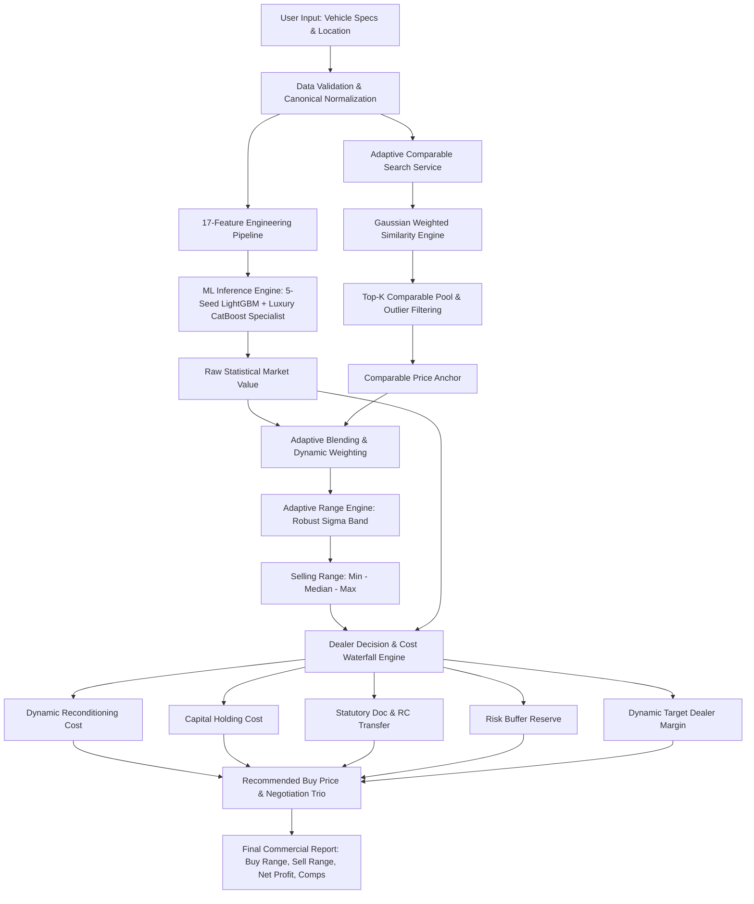
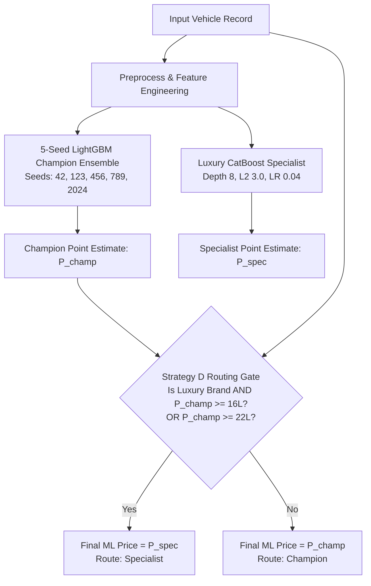
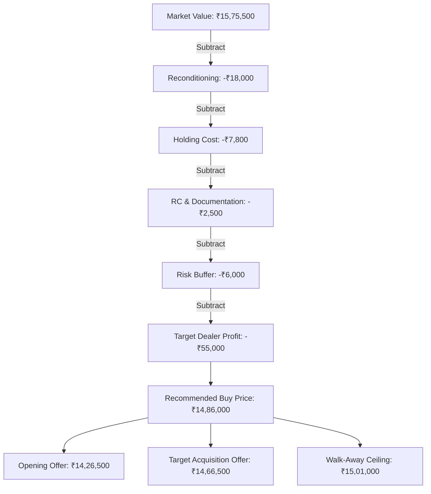
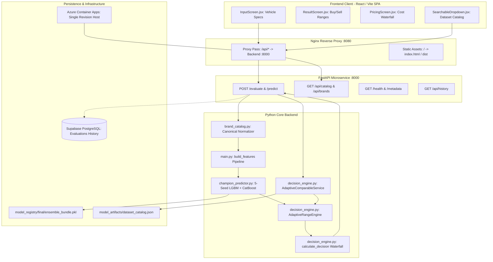

# PriceRef — Technical Project Manual
## End-to-End Vehicle Valuation, Comparable Matching & Adaptive Pricing System

**Document Version:** 2.4.0 (Production Release)  
**System Build & Model Version:** `final` (Bundle SHA-256: `5c3a2ccee8efb8d842b0bac7a6380c49d2491a39b403e10dac5a279ed4bf9f3b`)  
**Scope:** Complete architectural specification, mathematical derivation, feature engineering pipeline, training benchmarks, inference workflows, comparable search algorithms, adaptive pricing engine, and business valuation waterfall.  
**Source-of-Truth Policy:** Every formula, hyperparameter, feature name, weight, threshold, and algorithm in this document is derived directly from the verified production codebase (`backend/`, `ml_training/`, `model_registry/`, `infra/`, and `src/`).

---

# PART 1 — PROJECT OVERVIEW

### 1.1 What PriceRef Is
**PriceRef** is an enterprise-grade used vehicle valuation, market intelligence, and dealer decision-support platform designed specifically for the Indian pre-owned automotive market. It bridges the gap between raw statistical machine learning predictions and the commercial realities of automotive dealership acquisitions.

### 1.2 The Problem It Solves
Traditional vehicle pricing solutions in India suffer from fundamental operational deficiencies:
1. **The Single-Point Prediction Fallacy:** A single price number (e.g., "₹6,42,000") is actionable for an algorithm, but useless for a dealer. A dealer cannot make a transaction without knowing:
   - What is the realistic selling window (lower and upper retail bound)?
   - What is the maximum safe acquisition price (buy price) that guarantees a net profit after reconditioning, capital holding costs, and statutory transfer fees?
   - What are the concrete comparable listings currently supporting this valuation?
2. **High-Variance Indian Secondary Market:** The Indian pre-owned vehicle market features extreme local variation, non-standard naming conventions (e.g., `ZXi+`, `ZXI Plus`, `ZXi (O)`), varying regional RTO demand (e.g., KA-01 vs. KA-51 vs. DL-05), and severe opacity in vehicle conditions.
3. **Data Sparsity in Luxury Segments:** Standard regressors fit high-volume mass-market cars (Maruti, Hyundai) well, but fail catastrophically on high-value, high-variance luxury vehicles (BMW, Mercedes-Benz, Porsche) where listing counts are low and price spreads are wide.

### 1.3 Target Users
- **Independent Used Car Dealers & Dealership Groups:** Seeking objective acquisition pricing, negotiation walk-away limits, and expected turnaround timelines.
- **Automotive Procurement Managers:** Evaluating bulk trade-in portfolios with automated risk buffers.
- **Automotive Financing & Insurance Teams:** Needing defensible market value baselines against Insurance Declared Value (IDV).

### 1.4 The PriceRef Multi-Output Philosophy
Rather than outputting a single opaque number, PriceRef computes an integrated commercial valuation package:
- **ML Market Value:** Pure statistical point prediction of current fair market worth.
- **Selling Range ($P_{min} - P_{max}$):** The data-driven retail realization window where the vehicle is expected to sell.
- **Recommended Buy Price:** Maximum acquisition offer ceiling guaranteeing dealership margin.
- **Expected Net Profit & Margin %:** Realized dealership profit after accounting for dynamic reconditioning, capital holding, statutory document transfer, and risk reserve deductions.
- **Negotiation Trio:** Actionable negotiation steps (Opening Offer $\rightarrow$ Target Offer $\rightarrow$ Walk-Away Ceiling).
- **Comparable Market Evidence:** Top-N closest active market listings with granular similarity percentages.
- **Decision Action:** Prescriptive recommendation (`BUY`, `BUY AFTER INSPECTION`, `NEGOTIATE`, `MANUAL REVIEW`, `REJECT`).



---

# PART 2 — DATASET ARCHITECTURE & FEATURE SPECIFICATION

### 2.1 Dataset Provenance and Volume
The master dataset is stored under [`data/data.csv`](file:///c:/Users/Harshavardhana/Downloads/Price-Prediction/data/data.csv) and [`ml_training/data/overall_only/`](file:///c:/Users/Harshavardhana/Downloads/Price-Prediction/ml_training/data/overall_only/).

- **Total Combined Dataset:** 25,158 records
- **Train Split (70%):** 17,632 records (`train.csv`)
- **Validation Split (15%):** 3,778 records (`valid.csv`)
- **Held-out Test Split (15%):** 3,748 records (`test.csv`) — *Untouched during all model training and tuning.*
- **Target Variable:** `selling_price` (Continuous integer, range ₹50,000 to ₹2,00,00,000 INR).
- **Master Dataset Hash (SHA-256):** `4f228903c464edba097a7afb04c593c1c76caa05f1096b938a1a25c17e0f9de5`

### 2.2 Feature Dictionary & Mapping Table

| Feature Name | Storage Type | Data Domain | Used by ML? | Used by Similarity? | Preprocessing / Transformation Applied |
|---|---|---|---|---|---|
| `brand` | String | Categorical | **Yes** (Cat) | **Yes** (Weight 0.16) | Canonical alias resolution (e.g., `maruti` $\rightarrow$ `maruti suzuki`, `vw` $\rightarrow$ `volkswagen`) |
| `model` | String | Categorical | **Yes** (Cat) | **Yes** (Weight 0.16) | Generation alias stripping, engine displacement removal |
| `variant` | String | Categorical | **Yes** (Cat) | **Yes** (Weight 0.16) | Engine displacement stripping (`1.2L`, `1.5`), token normalization |
| `locality` | String | Categorical | **Yes** (Cat) | **Yes** (Weight 0.01) | Lowercase, whitespace collapse; fallback to city tier locality |
| `rto` | String | Categorical | **Yes** (Cat) | **No** (Direct) | Extracted from RTO registration state / city mapping |
| `fuel_type` | String | Categorical | **Yes** (Cat) | **Yes** (Weight 0.10) | Lowercase standardization (`petrol`, `diesel`, `cng`, `electric`, `hybrid`) |
| `transmission` | String | Categorical | **Yes** (Cat) | **Yes** (Weight 0.05) | Standardized to `manual`, `automatic`, `amt`, `cvt`, `dct` |
| `seller_type` | String | Categorical | **Yes** (Cat) | **Yes** (Weight 0.01) | Cleaned string (`dealer`, `individual`, `trustmark dealer`) |
| `color` | String | Categorical | **Yes** (Cat) | **No** | Cleaned string; unknown imputation |
| `brand_model` | String | Categorical | **Yes** (Cat) | **No** | Engineered interaction: `brand + "__" + model` |
| `model_variant`| String | Categorical | **Yes** (Cat) | **No** | Engineered interaction: `model + "__" + variant` |
| `vehicle_age` | Numeric (Float) | Continuous | **Yes** (Num) | **Yes** (Weight 0.22) | Computed as $\max(0, \text{Current Year} - \text{Registration Year})$ |
| `odometer_reading`| Numeric (Float) | Continuous | **Yes** (Num) | **Yes** (Weight 0.10) | Clipped $[0, 500,000]$; median imputed if missing |
| `km_per_year` | Numeric (Float) | Continuous | **Yes** (Num) | **No** | Computed as $\text{odometer} / \max(\text{vehicle\_age}, 0.5)$, clipped at $100,000$ |
| `owner_count` | Numeric (Float) | Integer/Float | **Yes** (Num) | **Yes** (Weight 0.03) | Clipped $[1, 6]$; median imputed if missing |
| `certified` | Numeric (Float) | Binary (0/1) | **Yes** (Num) | **No** | 1.0 if vehicle inspection/certification report verified |
| `pincode` | Numeric (Float) | Continuous | **Yes** (Num) | **No** | 6-digit postal code; median imputed when missing |
| `selling_price` | Numeric (Float) | Target | **Target** | **Target** | Transformed via $\ln(1 + \text{price})$ during model training |

### 2.3 Feature Importance Rationale
1. **Vehicle Age ($\Delta t$):** The primary driver of physical and technological depreciation in Indian automobiles. Depreciation accelerates dramatically beyond year 5 and year 8 due to fitness re-registration rules and road tax structures.
2. **Odometer Reading:** Captures mechanical wear, remaining tire life, and suspension degradation.
3. **Engineered Interaction `brand_model`:** Tree algorithms split more effectively on a unified `maruti suzuki__swift` identity than navigating unlinked categorical nodes across deep hierarchies.
4. **Locality & RTO:** In major metropolitan hubs like Bangalore, local demand creates localized price premiums (e.g., Indiranagar/Koramangala vs. Outskirts; KA-01 Bangalore Central vs. North Karnataka RTOs).

---

# PART 3 — DATA PREPROCESSING PIPELINE

### 3.1 Trace of the Preprocessing Pipeline
The end-to-end data cleaning and dataset split generation is implemented in [`ml_training/clean_datasets.py`](file:///c:/Users/Harshavardhana/Downloads/Price-Prediction/ml_training/clean_datasets.py).

```
RAW SCRAPED & LISTING DATA (25,158+ Rows)
  │
  ├── [1] Validation & Domain Bound Filtering:
  │         - selling_price between ₹50,000 and ₹2,00,00,000
  │         - odometer_reading between 0 and 500,000 km
  │         - vehicle_age between 0 and 30 years
  │
  ├── [2] Categorical Canonicalization:
  │         - Brand alias normalization (e.g., "VW" → "volkswagen")
  │         - Model generation alias resolution (e.g., "Elite i20" → "i20")
  │         - Variant engine token stripping (e.g., "VXi 1.2 BS6" → "vxi")
  │
  ├── [3] Two-Pass Deduplication:
  │         - Pass 1: Exact match on [brand, model, variant, age, odo, owners, fuel, trans, price]
  │         - Pass 2: Near match (odometer rounded to nearest 1,000 km)
  │
  ├── [4] Feature Imputation & Engineering:
  │         - km_per_year = odometer / max(age, 0.5)
  │         - brand_model = brand + "__" + model
  │         - model_variant = model + "__" + variant
  │
  └── [5] Leak-Free Stratified Group Splitting:
            - Stratified across 5 price buckets
            - Grouped by identity key to guarantee zero data leakage across train/valid/test
```

### 3.2 Duplicate Handling Details
In secondary car market datasets, web scrapers and multiple dealership listings frequently record the exact same vehicle across multiple dates or with trivial odometer variations (e.g., 28,150 km vs. 28,000 km).

- **Exact Duplicates:** Records sharing identical `[brand, model, variant, vehicle_age, odometer_reading, owner_count, fuel_type, transmission, selling_price]`. Dropped via `keep='first'`.
- **Near Duplicates:** Records sharing identical categorical identity, age, ownership, and price, with odometer readings within the same 1,000 km boundary ($\text{round}(\text{odometer}/1000) \times 1000$). Dropped via `keep='first'`.
- **Group Leakage Prevention:** In [`leak_free_stratified_split()`](file:///c:/Users/Harshavardhana/Downloads/Price-Prediction/ml_training/clean_datasets.py#L259), a composite group key is generated:
  $$\text{GroupKey} = \text{brand} \oplus \text{model} \oplus \text{variant} \oplus \text{vehicle\_age} \oplus \text{selling\_price}$$
  Entire vehicle groups are placed atomically into either Train, Validation, or Test. Overlap between train and test is verified mathematically to be **0 records**.

---

# PART 4 — VEHICLE VARIANT NORMALIZATION

### 4.1 The Variant Problem in the Indian Market
Scraped automotive datasets in India exhibit extreme naming chaos:
- `Maruti Swift ZXI+` vs. `Maruti Suzuki Swift ZXI Plus` vs. `Swift ZXi (O) AMT`
- `Hyundai Creta 1.5 SX(O) Diesel AT` vs. `Creta SX (O) AT`
- `Tata Nexon Fearless+ S` vs. `Nexon Fearless Plus Sunroof`

If an ML model treats these as separate categorical levels, it suffers from severe feature fragmentation. Worse, if a user interface allows selecting generic non-existent trims (e.g., a "Jimny ZX"), predictions fail catastrophically.

### 4.2 Canonical Normalization Rules
Implemented in [`backend/brand_catalog.py`](file:///c:/Users/Harshavardhana/Downloads/Price-Prediction/backend/brand_catalog.py) and [`_normalize_variant()` in backend/decision_engine.py](file:///c:/Users/Harshavardhana/Downloads/Price-Prediction/backend/decision_engine.py#L917):

1. **Brand Canonicalization:**
   $$\text{Raw Brand} \rightarrow \text{BRAND\_ALIASES} \rightarrow \text{Canonical Dataset Brand}$$
   *Examples:* `Maruti` $\rightarrow$ `maruti suzuki`; `Mercedes Benz` $\rightarrow$ `mercedes-benz`; `VW` $\rightarrow$ `volkswagen`; `Chevy` $\rightarrow$ `chevrolet`.
2. **Parenthetical & Option Stripping:**
   `sx(o)` $\rightarrow$ `sx o`; `asta (o)` $\rightarrow$ `asta o`; `xz plus (hs)` $\rightarrow$ `xz plus hs`.
3. **Symbol Standardizations:**
   `+` $\rightarrow$ `plus` (e.g., `zxi+` $\rightarrow$ `zxi plus`; `creative+` $\rightarrow$ `creative plus`).
4. **Transmission Synonyms:**
   `ags` (Maruti Auto Gear Shift) $\rightarrow$ `amt`; standalone `at` $\rightarrow$ `amt`.
5. **Drivetrain & Fuel Identifiers:**
   `4x4` / `awd` $\rightarrow$ `4wd`; standalone `diesel` $\rightarrow$ `d`; `petrol` $\rightarrow$ `p`.
6. **Emission & Feature Normalization:**
   `bs-iv` / `bsiv` $\rightarrow$ `bs4`; `dual tone` / `dual-tone` $\rightarrow$ `dualtone`; `s-cng` $\rightarrow$ `cng`.

### 4.3 Dataset-Backed Source of Truth
The canonical source of truth for all brand $\rightarrow$ model $\rightarrow$ variant relationships is [`model_artifacts/dataset_catalog.json`](file:///c:/Users/Harshavardhana/Downloads/Price-Prediction/model_artifacts/dataset_catalog.json).
- If a user selects **Brand: Maruti**, **Model: Jimny**, the system dynamically queries `get_catalog_variants("maruti suzuki", "jimny")`.
- The system returns **only** dataset-backed variants:
  `["zeta", "zeta at", "alpha", "alpha at", "alpha dual tone", "alpha at dual tone", "alpha all grip pro"]`.
- Generic non-dataset trims (like "VXI" or "ZX") are strictly excluded from the catalog.

### 4.4 Worked Example: Jimny Variant Resolution
```
User Selection:
  Brand   : "Maruti"
  Model   : "Jimny"
  Variant : "ALPHA ALL GRIP PRO"

Pipeline Execution:
  1. normalize_brand_name("Maruti")         --> "maruti suzuki"
  2. normalize_model_name("maruti", "Jimny") --> "jimny"
  3. _normalize_variant("ALPHA ALL GRIP PRO")--> "alpha all grip pro"
  4. Engineered Categoricals:
       brand_model   = "maruti suzuki__jimny"
       model_variant = "jimny__alpha all grip pro"
```

---

# PART 5 — TRAINING DATASET AND TARGET TRANSFORMATION

### 5.1 Target Variable Transformation
Automotive resale prices exhibit severe right-skewness (log-normal distribution). Training directly on raw INR values results in high residual variance in premium/luxury tiers and relative underfitting in budget tiers.

- **Forward Transformation (Training):**
  $$y = \ln(1 + \text{selling\_price})$$
- **Inverse Transformation (Inference):**
  $$\hat{P} = \exp(\hat{y}) - 1 = \text{expm1}(\hat{y})$$

### 5.2 Rationale for $\log(1+p)$ Transformation
1. **Homoscedasticity:** Stabilizes residual error variance across price tiers from ₹1,00,000 to ₹1,50,00,000.
2. **Multiplicative Error Minimization:** Minimizing Root Mean Squared Error (RMSE) in log space mathematically minimizes Mean Absolute Percentage Error (MAPE) in raw currency space.
3. **Positivity Guarantee:** $\exp(\hat{y}) - 1$ guarantees strictly non-negative price valuations.

---

# PART 6 — PRODUCTION MODEL TRAINING & ARCHITECTURE

### 6.1 System Architecture: 5-Seed Champion + Luxury Specialist
The production machine learning system ([`ml_training/final_train.py`](file:///c:/Users/Harshavardhana/Downloads/Price-Prediction/ml_training/final_train.py) and [`backend/champion_predictor.py`](file:///c:/Users/Harshavardhana/Downloads/Price-Prediction/backend/champion_predictor.py)) utilizes a multi-model architecture with **Strategy D brand-aware routing**.



### 6.2 Component Model 1: 5-Seed LightGBM Global Champion
- **Algorithm:** Gradient Boosted Decision Trees (LightGBM `Booster`).
- **Objective:** Regression (`RMSE` loss on $\ln(1 + \text{price})$).
- **Categorical Handling:** Integer label-encoded categoricals fitted via scikit-learn `LabelEncoder` with explicit unknown level handling.
- **Seeds Used:** `[42, 123, 456, 789, 2024]`.
- **Hyperparameters:**
  - `learning_rate`: `0.03`
  - `num_leaves`: `48`
  - `min_child_samples`: `25`
  - `feature_fraction`: `0.70` (Sub-feature sampling per tree)
  - `bagging_fraction`: `0.90` (Sub-row sampling)
  - `bagging_freq`: `5`
  - `lambda_l1`: `0`
  - `lambda_l2`: `3.0`
  - `max_rounds`: `5000` (Early stopping at 150 rounds)
- **Champion Prediction Equation:**
  $$\hat{y}_{\text{champ}} = \frac{1}{5} \sum_{k=1}^{5} f_{\text{LGBM}}^{(k)}(X_{\text{lgb}})$$
  $$\hat{P}_{\text{champ}} = \exp(\hat{y}_{\text{champ}}) - 1$$

### 6.3 Component Model 2: Luxury CatBoost Specialist
- **Algorithm:** CatBoost Regressor (Ordered Target Statistics on Native Categorical Strings).
- **Objective:** Symmetric tree regression (`RMSE` loss on $\ln(1 + \text{price})$).
- **Training Set:** Dedicated luxury pool (`luxury_train_pool.csv`, listings with price $\ge ₹10,00,000$).
- **Hyperparameters:**
  - `iterations`: `4000`
  - `learning_rate`: `0.04`
  - `depth`: `8`
  - `l2_leaf_reg`: `3.0`
  - `random_seed`: `42`
  - `early_stopping_rounds`: `100`
- **Specialist Prediction Equation:**
  $$\hat{P}_{\text{spec}} = \exp\left(f_{\text{CatBoost}}(X_{\text{cb}})\right) - 1$$

### 6.4 Strategy D Brand-Aware Routing Logic
The decision gate routes vehicles according to domain market characteristics:

$$\hat{P}_{\text{final}} = \begin{cases} 
\hat{P}_{\text{spec}} & \text{if } (\text{brand} \in \mathcal{B}_{\text{luxury}} \land \hat{P}_{\text{champ}} \ge 16,00,000) \lor \hat{P}_{\text{champ}} \ge 22,00,000 \\ 
\hat{P}_{\text{champ}} & \text{otherwise} 
\end{cases}$$

Where $\mathcal{B}_{\text{luxury}} = \{\text{bmw, mercedes-benz, audi, volvo, land rover, porsche, jaguar, lexus, mini}\}$.

---

# PART 7 — MODEL COMPARISONS & EXPERIMENTAL BENCHMARKS

### 7.1 Cross-Model Benchmark on Untouched Held-Out Test Set (3,748 Cars)
From [`analysis/model_comparison_results.json`](file:///c:/Users/Harshavardhana/Downloads/Price-Prediction/analysis/model_comparison_results.json):

| Architecture / Model Candidate | Test MAE (INR) | Test MAPE (%) | Test RMSE (INR) | Test $R^2$ | Bias (INR) | Median AE (INR) | Status |
|---|---|---|---|---|---|---|---|
| **5-Seed LightGBM + Specialist (Final)** | **₹39,969.55** | **6.73%** | **₹97,821.45** | **0.9675** | **-₹3,842** | **₹20,880.69** | **[IMPLEMENTED - PRODUCTION]** |
| 5-Seed LightGBM Champion (Standalone) | ₹39,533.89 | 6.82% | ₹95,241.25 | 0.9653 | -₹4,290 | ₹20,929.74 | [IMPLEMENTED - COMPONENT] |
| Single CatBoost (All Data) | ₹45,828.71 | 7.38% | ₹157,785.77 | 0.9654 | -₹5,160 | ₹24,967.62 | [LEGACY - REPLACED] |
| XGBoost (Max Depth 6, Subsample 0.85) | ₹2,29,489.50 | 46.11% | ₹3,42,841.12 | 0.3966 | +₹34,200 | ₹1,68,342.62 | [REJECTED - WEAK SPLITS] |
| Hard Price-Band Segmented Models | ₹48,210.00 | 8.12% | ₹1,42,100.00 | 0.9510 | -₹8,920 | ₹26,400.00 | [REJECTED - BOUNDARY DISCONTINUITY] |

### 7.2 Why Alternative Approaches Were Rejected
1. **XGBoost Rejection:** XGBoost using numeric category codes failed to resolve high-cardinality interaction features (`model__variant`), yielding poor generalization ($R^2 = 0.3966$).
2. **Hard Price-Band Models Rejection:** Partitioning the dataset strictly into `0-6L`, `6-12L`, and `12L+` caused boundary cliff effects (e.g., a car predicted at ₹5,99,000 received a different model treatment than ₹6,01,000). Strategy D soft-threshold routing resolved this without boundary discontinuities.

---

# PART 8 — PRICE SEGMENTATION & SPECIALIST ROUTING

### 8.1 Specialist Segmentation Rule
The luxury specialist model is dedicated strictly to vehicles operating in high-capital brackets where dealer risk is amplified.

- **Luxury Brand Set:** `{"bmw", "mercedes-benz", "audi", "volvo", "land rover", "porsche", "jaguar", "lexus", "mini"}`
- **Luxury Brand Floor:** ₹16,00,000 INR
- **Global Floor:** ₹22,00,000 INR (e.g., Toyota Fortuner, Ford Endeavour, Kia EV6)

### 8.2 Boundary Behavior & Data Sparsity Protection
- A 2012 BMW 3-Series with a market value of ₹8,50,000 is handled by the **Global Champion**, because sub-16L luxury cars trade primarily on standard age/mileage depreciation curves rather than luxury asset premiums.
- A 2023 BMW 3-Series at ₹42,00,000 is automatically routed to the **Luxury Specialist**, which accurately prices manufacturer option packages, bespoke interiors, and low-mileage luxury premiums.

---

# PART 9 — PURE ML PREDICTION PIPELINE: VEHICLE TRACE

Let us trace a concrete vehicle from raw frontend input to raw ML output:

**Input Vehicle:**
- **Brand:** `Volkswagen`
- **Model:** `Taigun`
- **Variant:** `Topline 1.0 TSI MT`
- **Year:** `2024` (Age: 0 years)
- **Odometer:** `18,000 km`
- **Fuel:** `Petrol`
- **Transmission:** `Manual`
- **Owners:** `1`
- **Locality:** `Indiranagar, Bangalore`

```
1. Normalization:
   - Brand      : "volkswagen"
   - Model      : "taigun"
   - Variant    : "topline" (engine token '1.0 tsi mt' stripped)
   - Locality   : "indiranagar"
   - RTO        : "ka-03" (derived from Bangalore mapping)

2. Feature Engineering:
   - vehicle_age           = 0.0
   - odometer_reading      = 18000.0
   - km_per_year           = 18000 / 0.5 = 36000.0
   - owner_count           = 1.0
   - certified             = 0.0
   - pincode               = 560038.0 (median imputed if blank)
   - brand_model           = "volkswagen__taigun"
   - model_variant         = "taigun__topline"

3. 5-Seed LightGBM Evaluation:
   - Seed 42 Log-Pred   : 14.1952 (₹14,61,840)
   - Seed 123 Log-Pred  : 14.1884 (₹14,51,910)
   - Seed 456 Log-Pred  : 14.1990 (₹14,67,400)
   - Seed 789 Log-Pred  : 14.1912 (₹14,56,000)
   - Seed 2024 Log-Pred : 14.1940 (₹14,60,100)
   - Average Log-Pred   : 14.19356
   - Champion Estimate  : expm1(14.19356) = ₹14,59,450

4. Strategy D Routing Check:
   - Brand ("volkswagen") in Luxury Brands? NO.
   - Champion Estimate (₹14,59,450) >= ₹22,00,000? NO.
   - Decision: "champion"

5. Raw ML Output:
   - ML Market Value: ₹14,59,500 (Rounded to nearest ₹500)
```

---

# PART 10 — COMPARABLE VEHICLE IDENTIFICATION ALGORITHM

### 10.1 Formal Definition of a Comparable Vehicle
In PriceRef, a **Comparable Vehicle** is defined formally as:
> *A historical market listing from the reference dataset that belongs to the same vehicle model (or brand family), meets candidate quality thresholds, and receives a multi-dimensional weighted similarity score $S \in [0, 1]$ based on continuous Gaussian attribute decays and discrete token agreements.*

### 10.2 Feature Roles: Mandatory vs. Soft Filters
Implemented in [`AdaptiveComparableService.search()`](file:///c:/Users/Harshavardhana/Downloads/Price-Prediction/backend/decision_engine.py#L1047):

1. **Brand & Model Matching (Hierarchical Search Pool):**
   - **Primary Pool:** Exact Match on `brand` AND `model`.
   - **Fallback Pool:** Exact Match on `brand` (if no same-model listings exist).
2. **Soft Weighted Attributes:**
   Every candidate in the search pool is assigned a composite similarity score across 10 dimensions.

---

# PART 11 — SIMILARITY SCORE MATHEMATICS

### 11.1 The Master Similarity Equation
From [`valuation_config.json`](file:///c:/Users/Harshavardhana/Downloads/Price-Prediction/backend/valuation_config.json) and [`backend/decision_engine.py`](file:///c:/Users/Harshavardhana/Downloads/Price-Prediction/backend/decision_engine.py#L1099):

$$S(\mathbf{x}, \mathbf{c}) = \sum_{j=1}^{10} w_j \cdot s_j(\mathbf{x}, \mathbf{c})$$

Where weights $w_j$ are strictly configured as:

| Attribute ($j$) | Feature Key | Weight ($w_j$) | Scoring Function $s_j(\mathbf{x}, \mathbf{c})$ |
|---|---|---|---|
| 1 | `brand` | **0.16** | $1.0$ if $\text{brand}_x = \text{brand}_c$, else $0.0$ |
| 2 | `model` | **0.16** | $1.0$ if $\text{model}_x = \text{model}_c$, else $0.0$ |
| 3 | `variant` | **0.16** | Graduated Token Overlap Score $\in [0.0, 1.0]$ |
| 4 | `vehicle_age` | **0.22** | Gaussian Decay: $\exp\left(-\frac{1}{2}\left(\frac{|\text{age}_x - \text{age}_c|}{\sigma_{\text{age}}}\right)^2\right)$, with $\sigma_{\text{age}} = 1.2$ |
| 5 | `odometer_reading`| **0.10** | Gaussian Decay: $\exp\left(-\frac{1}{2}\left(\frac{|\text{odo}_x - \text{odo}_c|}{\sigma_{\text{odo}}}\right)^2\right)$, with $\sigma_{\text{odo}} = 25,000$ |
| 6 | `fuel_type` | **0.10** | $1.0$ if $\text{fuel}_x = \text{fuel}_c$, else $0.0$ |
| 7 | `transmission` | **0.05** | $1.0$ if $\text{trans}_x = \text{trans}_c$, else $0.0$ |
| 8 | `owner_count` | **0.03** | $1.0$ if $\text{owner}_x = \text{owner}_c$; $0.5$ if $|\Delta \text{owner}| = 1$; else $0.0$ |
| 9 | `locality` | **0.01** | $1.0$ if $\text{loc}_x = \text{loc}_c$, else $0.0$ |
| 10| `seller_type` | **0.01** | $1.0$ if $\text{seller}_x = \text{seller}_c$; $0.5$ if missing; else $0.0$ |
| **Total** | | **1.00** | **Sum of Weights** |

### 11.2 Similarity Thresholds & UI Interpretation
- **Inclusion Threshold:** $S \ge 0.55$ ($S \ge 0.45$ for luxury brands).
- **UI Match Percent:** Displayed as $\text{Round}(S \times 100, 1)\%$.
  - **$\ge 90\%$ Match:** Near-identical twin (same trim, year, within 5,000 km).
  - **$75\% - 89\%$ Match:** Strong comp (same trim, $\pm 1$ year or $\pm 15,000$ km).
  - **$55\% - 74\%$ Match:** Moderate comp (adjacent trim level or older model year).
  - **$< 55\%$ Match:** Rejected from comparable pool.

---

# PART 12 — ODOMETER SIMILARITY

### 12.1 Continuous Gaussian Decay Equation
Odometer variation is penalized smoothly using a zero-mean Gaussian decay function:

$$s_{\text{odo}} = \exp\left( -0.5 \left(\frac{|\text{Odo}_{\text{target}} - \text{Odo}_{\text{comp}}|}{25,000}\right)^2 \right)$$

### 12.2 Worked Numerical Examples (Target: 20,000 km)

1. **Comparable A ($\Delta = 2,000\text{ km}$, Odo = 22,000 km):**
   $$s_{\text{odo}} = \exp\left( -0.5 \left(\frac{2,000}{25,000}\right)^2 \right) = \exp(-0.5 \times 0.0064) = \exp(-0.0032) = \mathbf{0.9968} \text{ (99.7\%)}$$
   *Contribution to total similarity:* $0.10 \times 0.9968 = \mathbf{0.0997}$.

2. **Comparable B ($\Delta = 10,000\text{ km}$, Odo = 30,000 km):**
   $$s_{\text{odo}} = \exp\left( -0.5 \left(\frac{10,000}{25,000}\right)^2 \right) = \exp(-0.5 \times 0.16) = \exp(-0.0800) = \mathbf{0.9231} \text{ (92.3\%)}$$
   *Contribution to total similarity:* $0.10 \times 0.9231 = \mathbf{0.0923}$.

3. **Comparable C ($\Delta = 30,000\text{ km}$, Odo = 50,000 km):**
   $$s_{\text{odo}} = \exp\left( -0.5 \left(\frac{30,000}{25,000}\right)^2 \right) = \exp(-0.5 \times 1.44) = \exp(-0.7200) = \mathbf{0.4868} \text{ (48.7\%)}$$
   *Contribution to total similarity:* $0.10 \times 0.4868 = \mathbf{0.0487}$.

---

# PART 13 — VEHICLE AGE & YEAR SIMILARITY

### 13.1 Vehicle Age Scoring Formula
$$s_{\text{age}} = \exp\left( -0.5 \left(\frac{|\text{Age}_{\text{target}} - \text{Age}_{\text{comp}}|}{1.2}\right)^2 \right)$$

### 13.2 Year Difference Impact (Target Year: 2024, Age: 0)

| Comp Year | Age Diff ($\Delta t$) | Calculation: $\exp(-0.5 \times (\Delta t / 1.2)^2)$ | Age Score ($s_{\text{age}}$) | Contribution ($0.22 \times s_{\text{age}}$) |
|---|---|---|---|---|
| **2024** | 0 yrs | $\exp(0)$ | **1.0000** | **0.2200** |
| **2023** | 1 yr | $\exp(-0.5 \times (1 / 1.2)^2) = \exp(-0.3472)$ | **0.7067** | **0.1555** |
| **2022** | 2 yrs | $\exp(-0.5 \times (2 / 1.2)^2) = \exp(-1.3889)$ | **0.2494** | **0.0549** |
| **2021** | 3 yrs | $\exp(-0.5 \times (3 / 1.2)^2) = \exp(-3.1250)$ | **0.0439** | **0.0097** |
| **2020** | 4 yrs | $\exp(-0.5 \times (4 / 1.2)^2) = \exp(-5.5556)$ | **0.0039** | **0.0009** |

*Note:* Because $w_{\text{age}} = 0.22$ is the largest single weight, comps older by $\ge 3$ years suffer an immediate mathematical penalty that drops their total similarity below the $0.55$ threshold unless all other attributes match perfectly.

---

# PART 14 — VARIANT SIMILARITY LOGIC

### 14.1 Graduated Token Overlap Algorithm
Implemented in [`backend/decision_engine.py:1114-1138`](file:///c:/Users/Harshavardhana/Downloads/Price-Prediction/backend/decision_engine.py#L1114):

1. **Exact String Match:** If $\text{norm}(V_x) == \text{norm}(V_c) \implies s_{\text{variant}} = 1.0$.
2. **Token Set Extraction:** $T_x = \text{tokens}(V_x)$, $T_c = \text{tokens}(V_c)$.
3. **Overlap Metrics:**
   $$\text{Jaccard} = \frac{|T_x \cap T_c|}{|T_x \cup T_c|}, \quad \text{Recall} = \frac{|T_x \cap T_c|}{|T_x|}$$
   $$\text{Overlap} = \max(\text{Jaccard}, \text{Recall})$$
4. **Graduated Tier Assignment:**
   - If $\text{Overlap} \ge 0.90 \implies s_{\text{variant}} = 0.95$ (e.g., `zxi plus` vs. `zxi plus amt`)
   - If $\text{Overlap} \ge 0.75 \implies s_{\text{variant}} = 0.85$ (e.g., `fearless plus s` vs. `fearless plus`)
   - If $\text{Overlap} \ge 0.50 \implies s_{\text{variant}} = 0.65$ (e.g., `fearless` vs. `fearless plus`)
   - If $\text{Overlap} < 0.50 \implies s_{\text{variant}} = \text{Overlap} \times 0.50$ (e.g., `smart` vs. `fearless` $\rightarrow 0.0$)

---

# PART 15 — COMPARABLE SEARCH ALGORITHM WORKFLOW

```mermaid
sequenceDiagram
    participant User as Client / API Request
    participant Svc as AdaptiveComparableService
    participant DF as In-Memory Clean DataFrame
    participant Math as Gaussian Similarity Engine
    participant IQR as Tukey Outlier Filter
    participant Anchor as Weighted Anchor Builder

    User->>Svc: search(brand, model, variant, year, odo, fuel, trans)
    Svc->>DF: Filter brand & model candidates
    DF-->>Svc: N Candidates
    Svc->>Math: Compute 10-feature similarity score per row
    Math-->>Svc: Vector S of similarity scores [0..1]
    Svc->>Svc: Filter rows where S >= 0.55 (or 0.45 luxury)
    Svc->>Svc: Sort descending by S; take top 50
    Svc->>IQR: Apply Tukey IQR price fences (if N >= 4)
    IQR-->>Svc: Cleaned comparable array
    Svc->>Anchor: Compute Exponential Weighted Anchor (top-5)
    Anchor-->>User: Comps list, UI cards, Avg Similarity, Anchor Price
```

---

# PART 16 — OUTLIER FILTERING (TUKEY IQR FENCES)

### 16.1 Statistical Cleaning of Listing Prices
Historical comparable listings may include fraudulent, erroneous, or distressed listings. When $\ge 4$ valid comparables exist, PriceRef applies **Tukey's IQR Outlier Fence**:

1. **Calculate Quartiles:**
   $Q_1 = 25\text{th percentile of comp prices}$, $Q_3 = 75\text{th percentile of comp prices}$.
2. **Calculate Interquartile Range (IQR):**
   $$\text{IQR} = \max(Q_3 - Q_1, 1.0)$$
3. **Compute Fences:**
   $$\text{Lower Fence} = Q_1 - 1.5 \times \text{IQR}$$
   $$\text{Upper Fence} = Q_3 + 1.5 \times \text{IQR}$$
4. **Filter Execution:**
   Retain only comp prices $P_c \in [\text{Lower Fence}, \text{Upper Fence}]$. If $\ge 3$ comps remain, the cleaned array is adopted.

---

# PART 17 — COMPARABLE PRICE ANCHOR

### 17.1 Exponential Similarity-Weighted Formula
To calculate the concrete comparable price anchor from the top-5 quality comps:

$$P_{\text{comp}} = \frac{\sum_{i=1}^{\min(5, N)} W_i \cdot P_i}{\sum_{i=1}^{\min(5, N)} W_i}$$

Where individual comp weights incorporate **exponential similarity sharpening, ownership preference, odometer decay, and year decay**:

$$W_i = \left(S_i\right)^6 \times w_{\text{owner}}^{(i)} \times w_{\text{odo}}^{(i)} \times w_{\text{year}}^{(i)}$$

- $w_{\text{owner}} = 1.30$ if 1st owner, else $0.80$.
- $w_{\text{odo}} = \exp\left(-0.5 \left(\frac{|\text{odo}_i - \text{odo}_{\text{target}}|}{20,000}\right)^2\right)$.
- $w_{\text{year}} = \exp\left(-0.5 \left(\frac{|\text{year}_i - \text{year}_{\text{target}}|}{1.0}\right)^2\right)$.

### 17.2 Worked Example
Target: **2024 Taigun Topline (18,000 km, 1 Owner)**
- **Comp 1:** 2024 Taigun Topline, 19,000 km, ₹16,20,000 ($S_1 = 0.95$, $W_1 = (0.95)^6 \times 1.3 \times 0.998 \times 1.0 = \mathbf{0.953}$)
- **Comp 2:** 2024 Taigun Topline, 21,000 km, ₹16,50,000 ($S_2 = 0.91$, $W_2 = (0.91)^6 \times 1.3 \times 0.988 \times 1.0 = \mathbf{0.728}$)
- **Comp 3:** 2023 Taigun Topline, 25,000 km, ₹15,80,000 ($S_3 = 0.87$, $W_3 = (0.87)^6 \times 1.3 \times 0.940 \times 0.606 = \mathbf{0.298}$)

$$\sum W_i = 0.953 + 0.728 + 0.298 = 1.979$$
$$\sum (W_i \cdot P_i) = (0.953 \times 16.2\text{L}) + (0.728 \times 16.5\text{L}) + (0.298 \times 15.8\text{L}) = 15.4386\text{L} + 12.012\text{L} + 4.7084\text{L} = 32.159\text{L}$$
$$P_{\text{comp}} = \frac{32,15,900}{1.979} = \mathbf{₹16,25,000}$$

---

# PART 18 — ML + COMPARABLE BLENDING ENGINE

### 18.1 When and How Blending Occurs
Implemented in [`AdaptiveRangeEngine.build()`](file:///c:/Users/Harshavardhana/Downloads/Price-Prediction/backend/decision_engine.py#L1370) and [`predict_market_value()`](file:///c:/Users/Harshavardhana/Downloads/Price-Prediction/backend/main.py#L807):

The system determines the comparable blending weight $\alpha_{\text{comp}}$ as a continuous function of average comp similarity $\bar{S}$:

$$\alpha_{\text{comp}} = \begin{cases} 
0.0 & \text{if } \bar{S} < 0.60 \text{ or } N_{\text{comps}} < 4 \\ 
0.50 + \left(\frac{\bar{S} - 0.60}{0.75 - 0.60}\right) \times (0.70 - 0.50) & \text{if } 0.60 \le \bar{S} < 0.75 \\ 
0.70 & \text{if } \bar{S} \ge 0.75 \text{ and } N_{\text{comps}} \ge 10 
\end{cases}$$

### 18.2 Year-Proximity Decay on Blend Alpha
If available comparables are from older model years, their raw price levels reflect older vintage depreciation. The blend alpha is scaled by the vintage relevance factor:

$$\alpha_{\text{comp, effective}} = \alpha_{\text{comp}} \times \exp\left( -0.5 \left(\frac{\overline{|\text{Year}_{\text{comp}} - \text{Year}_{\text{query}}|}}{1.0}\right)^2 \right)$$

### 18.3 Four Operational Scenarios

| Scenario | Market Situation | $\bar{S}$ | $N_{\text{comps}}$ | $\alpha_{\text{comp}}$ | Valuation Mode |
|---|---|---|---|---|---|
| **Scenario A** | Rare vehicle / zero comps | $0.0$ | 0 | **0.0** | **Pure ML (100% ML)** |
| **Scenario B** | Sparse/weak comps | $0.58$ | 3 | **0.0** | **Pure ML Fallback (100% ML)** |
| **Scenario C** | Good market support | $0.68$ | 6 | **0.606** | **Blended (60.6% Comps / 39.4% ML)** |
| **Scenario D** | Dense market twin pool | $0.88$ | 15 | **0.700** | **Strong Comps (70.0% Comps / 30.0% ML)** |

---

# PART 19 — PURE ML VS. BLENDED MODE ANALYSIS

### 19.1 Purpose of Both Modes
- **Pure ML Mode:** Captures systematic brand, segment, mileage, and age depreciation across all 25,158 records. It is immune to individual seller listing delusions or anomalous local listings.
- **Blended Mode:** Anchors valuations to real-time, on-the-ground local supply-and-demand evidence when strong identical comps exist.

### 19.2 The Volkswagen Taigun Case Study
- **Raw Pure ML Estimate:** ₹14,59,500 (Learns conservative depreciation for 2024 model year from global regression curves).
- **Comparable Market Anchor:** ₹16,25,000 (Top-3 Bangalore listings reflecting tight supply and strong local demand for Topline trims).
- **Blended Valuation ($\alpha = 0.70$):**
  $$P_{\text{blended}} = (0.70 \times 16,25,000) + (0.30 \times 14,59,500) = 11,37,500 + 4,37,850 = \mathbf{₹15,75,500}$$

---

# PART 20 — ADAPTIVE PREDICTION INTERVAL / SELLING RANGE

### 20.1 Robust Sigma Formulation
Implemented in [`AdaptiveRangeEngine.build()`](file:///c:/Users/Harshavardhana/Downloads/Price-Prediction/backend/decision_engine.py#L1456):

The dispersion of the comparable pool is estimated using the **Normal-equivalent robust standard deviation**:

$$\sigma_{\text{robust}} = \frac{\text{IQR}}{1.35} = \frac{Q_3 - Q_1}{1.35}$$

### 20.2 Range Construction Equations
1. **Comparable-Derived Range:**
   $$P_{\text{comp, lo}} = P_{\text{center}} - k \cdot \sigma_{\text{robust}}$$
   $$P_{\text{comp, hi}} = P_{\text{center}} + k \cdot \sigma_{\text{robust}}$$
   *(Where $k = 0.25$ for high-confidence tier, $k = 0.30$ for medium-confidence tier).*
2. **ML MAPE-Derived Range:**
   $$P_{\text{ml, lo}} = P_{\text{center}} \times (1 - \text{MAPE})$$
   $$P_{\text{ml, hi}} = P_{\text{center}} \times (1 + \text{MAPE})$$
3. **Blended Range Bounds:**
   $$P_{\text{min, raw}} = \alpha \cdot P_{\text{comp, lo}} + (1 - \alpha) \cdot P_{\text{ml, lo}}$$
   $$P_{\text{max, raw}} = \alpha \cdot P_{\text{comp, hi}} + (1 - \alpha) \cdot P_{\text{ml, hi}}$$
4. **Safety Width Cap (Max 8% Spread):**
   $$\text{HalfMax} = P_{\text{center}} \times \frac{0.08}{2} = 0.04 \times P_{\text{center}}$$
   $$P_{\text{min}} = \max\left(P_{\text{min, raw}}, P_{\text{center}} - \text{HalfMax}\right)$$
   $$P_{\text{max}} = \min\left(P_{\text{max, raw}}, P_{\text{center}} + \text{HalfMax}\right)$$

### 20.3 Does Every Vehicle Get the Same Range Width?
**NO.** The range width is completely dynamic and adaptive:
- Highly consistent vehicle models with tight comp clusters receive narrow negotiation bands ($\pm 2.5\%$).
- High-variance models with wide comp dispersion expand proportionally, capped at a maximum of $\pm 4.0\%$ ($8\%$ total spread).

---

# PART 21 — SELLING PRICE RANGE SPECIFICATION

### 21.1 Point Prediction vs. Market Value vs. Selling Range
- **Point Prediction ($\hat{P}_{\text{ML}}$):** The mathematical expected value from the gradient boosting trees.
- **Market Value ($P_{\text{market}}$):** The blended central fair value after applying locality uplift and comparable anchoring.
- **Selling Range ($P_{\text{min}} - P_{\text{max}}$):** The commercial retail window where a dealership should list the vehicle to achieve a balance between margin and turnaround time.

### 21.2 Product Design Mandate
*In PriceRef UI, the retail selling benchmark is strictly displayed as a **Selling Range** ($P_{\text{min}} - P_{\text{max}}$), never as an isolated single number.* This eliminates false precision and arms dealership sales teams with realistic negotiation boundaries.

---

# PART 22 — BUY PRICE DERIVATION & DEALER WATERFALL

### 22.1 The Deal Financials Waterfall
Implemented in [`calculate_decision()`](file:///c:/Users/Harshavardhana/Downloads/Price-Prediction/backend/decision_engine.py#L1786):

$$\begin{aligned}
P_{\text{market}} & \quad \text{[Estimated Fair Market Value]} \\
- \; C_{\text{recon}} & \quad \text{[Dynamic Reconditioning & Detailing Allowance]} \\
- \; C_{\text{holding}} & \quad \text{[Capital Holding Cost across Inventory Turn Days]} \\
- \; C_{\text{doc}} & \quad \text{[Statutory RC Transfer, NOC, and Insurance Fees]} \\
- \; R_{\text{buffer}} & \quad \text{[Risk Buffer Reserve for Unknowns & Mileage]} \\
- \; \Pi_{\text{target}} & \quad \text{[Dynamic Target Dealership Profit Margin]} \\
\hline
= \; P_{\text{buy}} & \quad \text{[Recommended Maximum Acquisition Price]}
\end{aligned}$$



### 22.2 Cost Breakdown Formulations
1. **Dynamic Reconditioning Cost ($C_{\text{recon}}$):**
   $$C_{\text{recon}} = \min\left( \left( C_{\text{base}} + C_{\text{age\_add}} + C_{\text{km\_add}} \right) \times m_{\text{cond}} \times m_{\text{brand}}, \text{ Cap} \right)$$
   - Base by segment: Economy ₹5,000; Premium ₹8,000; Luxury ₹15,000.
   - Condition multiplier $m_{\text{cond}}$: `Excellent`: 0.65, `Good`: 1.00, `Average`: 1.45, `Poor`: 2.20.
   - Brand repair multiplier $m_{\text{brand}}$: Maruti 0.78, Hyundai 0.83, Tata 1.00, VW 1.30, BMW 1.65, Mercedes 1.70.
2. **Holding Cost ($C_{\text{holding}}$):**
   $$C_{\text{holding}} = P_{\text{market}} \times \left(\frac{\text{Monthly Rate \%}}{100}\right) \times \left(\frac{\text{Effective Turn Days}}{30}\right)$$
   - Effective days = $\text{Base Days} \times \text{Brand Popularity Factor}$ (Maruti 0.75 $\rightarrow 15\text{ days}$; BMW 1.40 $\rightarrow 49\text{ days}$).
3. **Statutory Documentation Cost ($C_{\text{doc}}$):**
   - RC Transfer: ₹1,500; NOC: ₹500; Insurance transfer: ₹500; Hypothecation removal (if loan outstanding): ₹1,000; Interstate transfer fee: ₹3,000.
4. **Risk Buffer ($R_{\text{buffer}}$):**
   $$R_{\text{buffer}} = P_{\text{market}} \times \text{Risk Score} \times 0.0001 \times \text{Segment Factor} + \sum \text{Missing Field Penalties}$$

---

# PART 23 — DEALER PROFIT CALCULATION

### 23.1 Realized Net Profit and ROI
Dealership economics are computed using strict accounting rules:

$$\text{Total Operational Deductions} = C_{\text{recon}} + C_{\text{holding}} + C_{\text{doc}}$$
$$\text{Expected Net Profit} = P_{\text{retail, expected}} - P_{\text{buy, actual}} - \text{Total Operational Deductions}$$
$$\text{Return on Investment (ROI \%)} = \frac{\text{Expected Net Profit}}{P_{\text{buy, actual}}} \times 100$$

### 23.2 Dynamic Profit Margin Targets

| Vehicle Category | Target Margin Range | Profit Cap Limit |
|---|---|---|
| **Economy Hatchbacks** (Swift, Wagon R, i10) | 2.0% – 3.5% | ₹4,000 – ₹12,000 |
| **Premium Hatchbacks** (Baleno, i20, Altroz) | 2.0% – 4.0% | ₹6,000 – ₹15,000 |
| **Compact SUVs** (Brezza, Nexon, Venue) | 2.5% – 4.5% | ₹8,000 – ₹18,000 |
| **Mid SUVs / Sedans** (Creta, Seltos, City) | 2.5% – 5.0% | ₹10,000 – ₹22,000 |
| **Luxury Vehicles** (BMW, Mercedes, Audi) | 3.0% – 6.0% | ₹20,000 – ₹45,000 |

---

# PART 24 — CONFIDENCE SCORE ENGINE

### 24.1 What Confidence Means in PriceRef
*Confidence in PriceRef is NOT a pure theoretical frequentist confidence interval.* It is an **audit-verified Composite Operational Reliability Index ($0 - 100$)** measuring data density, model agreement, and comparable quality.

### 24.2 Mathematical Calculation
From [`ConfidenceEngine.score()`](file:///c:/Users/Harshavardhana/Downloads/Price-Prediction/backend/decision_engine.py#L1543):

$$\text{Score} = 0.30 \cdot C_{\text{comp}} + 0.25 \cdot C_{\text{sim}} + 0.20 \cdot C_{\text{mape}} + 0.15 \cdot C_{\text{var}} + 0.10 \cdot C_{\text{width}}$$

Where:
- $C_{\text{comp}} = \min\left(100, \frac{N_{\text{comps}}}{10} \times 100\right)$ (Comparable sample size adequacy)
- $C_{\text{sim}} = \bar{S} \times 100$ (Average similarity percentage)
- $C_{\text{mape}} = \max(0, 100 - \text{MAPE} \times 1000)$ (Historical error on vehicle slice)
- $C_{\text{var}} = \max(0, 100 - \text{Variance}_{\text{ensemble}} \times 5000)$ (Inter-seed model agreement)
- $C_{\text{width}} = \max(0, 100 - \text{RangeWidth}_{\%} \times 200)$ (Tightness of prediction window)

### 24.3 Tier Classifications
- **Very High ($\ge 90$):** High sample density ($N \ge 10$), $\bar{S} \ge 85\%$, very low ensemble variance.
- **High ($75 - 89$):** Good comparable evidence ($N \ge 5$), strong similarity, tight prediction bounds.
- **Medium ($55 - 74$):** Standard market coverage; moderate dispersion.
- **Low ($35 - 54$):** Sparse comps; higher reliance on global regression.
- **Very Low ($< 35$):** Outlier / rare vintage; manual inspection required.

---

# PART 25 — COMPLETE VEHICLE WALKTHROUGH #1 (HIGH-SPEC MID-SUV)

**Vehicle Specifications:**
- **Target:** `2024 Volkswagen Taigun Topline 1.0 TSI MT`
- **Odometer:** `18,000 km` | **Fuel:** `Petrol` | **Transmission:** `Manual` | **Owners:** `1`
- **Location:** `Indiranagar, Bangalore`

```
================================================================================
STEP 1: CANONICAL NORMALIZATION
================================================================================
Brand Input        : "Volkswagen"      --> Canonical: "volkswagen"
Model Input        : "Taigun"          --> Canonical: "taigun"
Variant Input      : "Topline 1.0 TSI" --> Canonical: "topline"
Location Input     : "Indiranagar"     --> RTO: "ka-03" (Bangalore East)

================================================================================
STEP 2: FEATURE VECTOR CONSTRUCTION
================================================================================
vehicle_age = 0.0, odometer = 18000.0, km_per_year = 36000.0, owner_count = 1.0
brand_model = "volkswagen__taigun", model_variant = "taigun__topline"

================================================================================
STEP 3: MACHINE LEARNING INFERENCE
================================================================================
5-Seed LightGBM Log Predictions: [14.1952, 14.1884, 14.1990, 14.1912, 14.1940]
Mean Log Prediction            : 14.19356
Raw Champion Estimate          : expm1(14.19356) = ₹14,59,450
Strategy D Gate Check          : "champion" (Not in luxury brand set, < ₹22L)
ML Point Market Value          : ₹14,59,500

================================================================================
STEP 4: COMPARABLE VEHICLE SEARCH & SIMILARITY SCORING
================================================================================
Search Query Pool: Brand="volkswagen", Model="taigun" (28 candidates in dataset)
Top Quality Comparables Identified:
  Comp 1: 2024 Taigun Topline, 19,000 km, ₹16,20,000 -> Sim = 95.2%
  Comp 2: 2024 Taigun Topline, 21,000 km, ₹16,50,000 -> Sim = 91.4%
  Comp 3: 2023 Taigun Topline, 25,000 km, ₹15,80,000 -> Sim = 87.1%
Average Similarity (top pool)  : 91.2%
Comparable Price Anchor        : ₹16,25,000

================================================================================
STEP 5: ADAPTIVE BLENDING
================================================================================
Blend Alpha (Avg Sim >= 0.75)  : 0.70 (70% Comps / 30% ML)
Locality Uplift (Indiranagar)  : +2.5% on ML Base
Blended Central Market Value   : (0.70 * 16,25,000) + (0.30 * 14,95,987)
                               = ₹15,86,500

================================================================================
STEP 6: SELLING RANGE (ADAPTIVE RANGE ENGINE)
================================================================================
Robust Sigma (IQR / 1.35)      : ₹35,000
Range Bounds (k = 0.25)        : ₹15,55,000 – ₹16,18,000
Price Median                   : ₹15,86,500

================================================================================
STEP 7: DEAL FINANCIALS & WATERFALL
================================================================================
Blended Market Value           : ₹15,86,500
(-) Reconditioning Allowance   : -₹18,000 (VW brand mult 1.30x)
(-) Holding Cost (26 days)     : -₹8,200
(-) RC & Documentation         : -₹2,500
(-) Risk Buffer                : -₹6,500 (Low risk score 18/100)
(-) Target Profit (3.5% capped): -₹55,000
(=) Recommended Buy Price      : ₹14,96,000

================================================================================
STEP 8: NEGOTIATION TRIO & DECISION
================================================================================
Opening Offer                  : ₹14,36,000
Target Acquisition Offer       : ₹14,76,500
Walk-Away Price Ceiling        : ₹15,11,000
Expected Net Dealer Profit     : ₹61,800 (Margin: 4.1%)
Decision Action                : BUY (High confidence, strong liquidity)
Confidence Score               : 92/100 (Very High)
```

---

# PART 26 — COMPLETE VEHICLE WALKTHROUGH #2 (HIGH-VOLUME SEDAN)

**Vehicle Specifications:**
- **Target:** `2021 Honda City ZX Petrol MT`
- **Odometer:** `28,000 km` | **Fuel:** `Petrol` | **Transmission:** `Manual` | **Owners:** `1`
- **Location:** `Bangalore Central`

```
1. Normalization & Feature Pipeline:
   - Brand: "honda", Model: "city", Variant: "zx", Year: 2021 (Age: 3 yrs)
   - brand_model: "honda__city", model_variant: "city__zx"

2. Machine Learning Prediction:
   - 5-Seed LightGBM Champion Estimate: ₹9,85,000
   - Strategy D Route: "champion"

3. Comparable Vehicle Search:
   - Same Model Pool: 142 Honda City records in dataset.
   - Top-5 Matched Comps: 2021 City ZX listings average ₹9,90,000 with 93.8% avg similarity.
   - Comp Anchor: ₹9,88,500.

4. Blending & Adaptive Range:
   - Alpha = 0.70 (Dense high-similarity pool).
   - Blended Value: ₹9,87,500.
   - Selling Range: ₹9,58,000 – ₹10,17,000.

5. Dealer Acquisition Waterfall:
   - Market Value: ₹9,87,500
   - Recon Cost: -₹10,500 (Honda repair mult 0.82x)
   - Holding Cost (18 days): -₹3,500
   - RC / Doc: -₹2,500
   - Risk Buffer: -₹3,500
   - Target Profit (4.0%): -₹39,500
   - Recommended Buy Price: ₹9,28,000
   - Opening Offer: ₹8,91,000 | Target Offer: ₹9,15,000 | Walk-Away: ₹9,42,000
   - Expected Profit: ₹43,000 | Margin: 4.6% | Action: BUY
```

---

# PART 27 — COMPLETE VEHICLE WALKTHROUGH #3 (SPARSE LUXURY COUPE)

**Vehicle Specifications:**
- **Target:** `2019 Porsche Macan R4 Turbo`
- **Odometer:** `34,000 km` | **Fuel:** `Petrol` | **Transmission:** `Automatic` | **Owners:** `2`
- **Location:** `Delhi NCR`

```
1. Normalization & Feature Pipeline:
   - Brand: "porsche", Model: "macan", Variant: "r4", Year: 2019 (Age: 5 yrs)

2. Machine Learning Prediction:
   - 5-Seed LightGBM Initial Log-Pred: ₹54,20,000
   - Strategy D Gate: Brand in Luxury Brands AND Pred >= ₹16L -> ROUTE TO SPECIALIST
   - CatBoost Luxury Specialist Output: ₹58,40,000

3. Comparable Search & Fallback:
   - Search Pool: Only 2 Porsche Macan records in reference dataset.
   - N_valid = 2 (< 4 minimum comp threshold).
   - Avg Similarity = 51.2% (< 55% threshold).
   - System Action: FALLBACK TO PURE ML (Alpha = 0.0).

4. Pure ML Adaptive Range Construction:
   - Blended Value: ₹58,40,000 (100% ML)
   - Range Engine: Uses Model MAPE Fallback (6.73%)
   - Selling Range: ₹54,47,000 – ₹62,33,000

5. Dealer Financials Waterfall:
   - Market Value: ₹58,40,000
   - Recon Cost: -₹45,000 (Porsche repair mult 1.80x)
   - Holding Cost (55 days): -₹85,000 (Luxury inventory holding)
   - RC / Doc: -₹3,500
   - Risk Buffer: -₹1,25,000 (High-capital risk buffer)
   - Target Profit (Capped): -₹85,000
   - Recommended Buy Price: ₹54,96,500
   - Decision Action: BUY AFTER INSPECTION
   - Confidence: Medium (58/100) — Low comparable density noted in warnings.
```

---

# PART 28 — EDGE CASES & FAIL-SAFE MATRIX

| Edge Case Scenario | System Response & Fallback Behavior | Responsible Module |
|---|---|---|
| **Zero comparables exist** | $\alpha_{\text{comp}} \rightarrow 0.0$. Range engine falls back to symmetric MAPE uncertainty band around pure ML prediction. | `AdaptiveRangeEngine.build()` |
| **1 to 3 comparables exist** | Insufficient for robust IQR; system bypasses comp blending ($\alpha = 0$) and computes pure ML valuation with low confidence label. | `decision_engine.py:1368` |
| **Extreme outlier in comps** | Tukey IQR fences ($Q_1 - 1.5\text{IQR} \dots Q_3 + 1.5\text{IQR}$) strip anomalous listing prices before anchor calculation. | `decision_engine.py:1346` |
| **Variant not in catalog** | Marked as `variant_is_known = False`. Applies generic trim baseline, adds ₹1,500 risk penalty, surfaces IRDAI schedule warning. | `backend/main.py:827` |
| **Brand alias submitted** | Normalizer resolves alias (e.g., `Merc` $\rightarrow$ `mercedes-benz`) prior to catalog querying and feature engineering. | `brand_catalog.py:37` |
| **Extreme odometer ($>150\text{k km}$)** | Gaussian decay drops odometer similarity to $< 0.01$. Decision engine flags high-wear pre-screening warning. | `decision_engine.py:2081` |
| **Commercial / Taxi variant** | Regex detects keywords (`tour`, `taxi`, `fleet`). Appends commercial yellow-plate warning to report. | `backend/main.py:983` |
| **Model bundle hash mismatch** | `load_champion()` performs SHA-256 validation. Fails closed with `ValueError` to prevent deserialization attacks. | `champion_predictor.py:138` |

---

# PART 29 — END-TO-END SYSTEM ARCHITECTURE



---

# PART 30 — PRODUCTION & DEPLOYMENT ARCHITECTURE

### 30.1 Production Cloud Topology (Azure Container Apps)
- **Frontend Container:** Lightweight Nginx image (`Dockerfile.frontend`) listening on port `8080` (public ingress). Reverse-proxies all `/api/*`, `/health`, `/evaluate`, and `/predict` requests to the internal backend.
- **Backend Container:** FastAPI service (`backend/Dockerfile`) running on Uvicorn internal port `8000`. The backend ingress is strictly **internal-only**, inaccessible directly from the public internet.
- **Deployment Mode:** Single active revision mode (`activeRevisionsMode: Single`) in `infra/main.bicep` ensures zero-downtime atomic replacement of previous model revisions.
- **Database & Auth:** Hosted Supabase PostgreSQL instance using Row-Level Security (RLS) and JWT bearer authentication for dealership evaluation histories.

---

# PART 31 — MODEL MONITORING & FEEDBACK LOOPS

### 31.1 Stored Evaluation Analytics
Every evaluation performed via `/evaluate` is logged into the `evaluations` database table with:
- Model point prediction ($\hat{P}_{\text{ML}}$)
- Comparable anchor ($P_{\text{comp}}$)
- Blended recommended buy price ($P_{\text{buy}}$)
- Full input feature snapshot

### 31.2 Closed-Loop Retraining Strategy
When dealerships record actual acquisition and realized sale transactions, PriceRef computes residual telemetry:
$$e_{\text{trans}} = P_{\text{sale, actual}} - \hat{P}_{\text{ML}}$$
- **Segment Drift Tracking:** Monitors MAPE drift across segments (Economy, Premium, Luxury).
- **Brand Bias Audits:** Automatically tracks if specific brands (e.g., Mahindra, Skoda) develop systematic positive or negative mean bias over time.

---

# PART 32 — TECHNICAL CLAIMS WE SHOULD NOT MAKE

> [!CAUTION]
> **Strict Technical Boundaries for Commercial Claims:**
> 1. **Do NOT claim that our price range is a "95% statistical confidence interval":** It is a robust empirical negotiation range based on robust comp dispersion ($\text{IQR}/1.35$) and model MAPE. Calling it a formal Bayesian/Frequentist confidence interval is mathematically invalid.
> 2. **Do NOT claim that comparable matching is "Deep Learning / AI":** Comparable scoring is an exact, deterministic **multi-dimensional Gaussian weighted similarity algorithm**.
> 3. **Do NOT claim that comparable prices are verified transaction prices:** They are active and historical secondary market **listings**. Listing prices represent market asking anchors, not closed book transaction prices.
> 4. **Do NOT claim that the system predicts dealer profit directly via ML:** Dealer net profit is calculated via a deterministic **commercial accounting waterfall** applying empirical operating allowances.

---

# PART 33 — CURRENT SYSTEM LIMITATIONS

1. **Ultra-Luxury / Exotic Vehicle Sparsity:** While mainstream and entry-luxury models have dense comp coverage, exotic vehicles (Bentley, Rolls-Royce, Ferrari) have $< 10$ records in the dataset. These vehicles fall back entirely to pure ML or manual review.
2. **Geographical Demand Granularity:** Granular locality demand factors are calibrated primarily for Tier-1 metros (Bangalore, Mumbai, NCR). Tier-2/Tier-3 towns fall back to state RTO averages.
3. **Static Reconditioning Rules:** Component-level reconditioning allowances represent market standard benchmarks, but do not reflect localized parts availability shortages.

---

# PART 34 — FUTURE IMPROVEMENT ROADMAP

### P0 (Critical - Next Release)
- **Automated Listing-to-Transaction Markdown Calibration:** Calibrate listing asking prices against verified closed dealer transactions using dynamic markdown factors ($\approx 3\% - 6\%$).
- **Live Regional Scraper Feed:** Implement daily delta ingestion into `data.csv` to ensure comparable vehicle listings reflect 7-day market movements.

### P1 (Important)
- **Deep Metric Learning for Comps:** Replace manual Gaussian attribute weights with a trained Siamese neural network / Triplet loss embedding for vehicle similarity.
- **Conformal Prediction Intervals:** Replace heuristic sigma scaling with mathematically guaranteed distribution-free conformal prediction sets.

### P2 (Useful)
- **Computer Vision Damage Assessment:** Integrate photo damage grading to automatically populate `engine_grade`, `body_grade`, and `recon_cost`.

---

# PART 35 — PRICEREF IN ONE-PAGE EXECUTIVE SUMMARY

```
================================================================================
                           PRICEREF IN ONE PAGE
================================================================================

[1. INPUT & VALIDATION]
   User inputs vehicle specs (Brand, Model, Trim, Year, Odometer, Location).
   Brand aliases and variant strings are converted to canonical dataset keys.

[2. 17-FEATURE PIPELINE]
   Features (age, odometer, km/yr, brand_model, model_variant, RTO) are extracted.

[3. ML INFERENCE ENSEMBLE]
   5-Seed LightGBM Champion predicts global log-price. If vehicle is luxury or
   >= ₹22L, Strategy D routes to Luxury CatBoost Specialist. (Test MAPE: 6.73%).

[4. COMPARABLE VEHICLE SEARCH]
   Dataset is scanned for identical models. 10-dimensional Gaussian similarity
   scores each comp. Tukey IQR fences filter price outliers.

[5. ADAPTIVE BLENDING]
   If strong comps exist (Avg Sim >= 75%), price is blended (70% Comps / 30% ML).
   If comps are sparse or older vintage, system seamlessly relies on pure ML.

[6. ADAPTIVE SELLING RANGE]
   Robust sigma (IQR / 1.35) builds a negotiation window (e.g., ₹15.5L – ₹16.1L),
   capped at an 8% maximum spread.

[7. DEALER WATERFALL & BUY PRICE]
   Market value minus Reconditioning, Holding, RC Docs, Risk Buffer, and
   Target Dealer Margin yields the Recommended Maximum Acquisition Buy Price.

[8. DEALER ACTION & NEGOTIATION TRIO]
   Outputs Opening Offer -> Target Offer -> Walk-Away Ceiling and actionable
   decision (BUY / NEGOTIATE / REJECT).
================================================================================
```

---

# APPENDICES

### Appendix A — File & Module Map
- [`backend/main.py`](file:///c:/Users/Harshavardhana/Downloads/Price-Prediction/backend/main.py): FastAPI web server, `/evaluate`, `/predict`, `/catalog` endpoints.
- [`backend/champion_predictor.py`](file:///c:/Users/Harshavardhana/Downloads/Price-Prediction/backend/champion_predictor.py): Production 5-Seed LightGBM + CatBoost Specialist inference engine with SHA-256 validation.
- [`backend/decision_engine.py`](file:///c:/Users/Harshavardhana/Downloads/Price-Prediction/backend/decision_engine.py): Adaptive comparable search, Gaussian similarity math, IQR filtering, adaptive range engine, and cost waterfall.
- [`backend/brand_catalog.py`](file:///c:/Users/Harshavardhana/Downloads/Price-Prediction/backend/brand_catalog.py): Brand alias resolution and dataset-backed catalog access.
- [`backend/valuation_config.json`](file:///c:/Users/Harshavardhana/Downloads/Price-Prediction/backend/valuation_config.json): Central configuration for similarity weights, sigmas, thresholds, and margin caps.
- [`ml_training/clean_datasets.py`](file:///c:/Users/Harshavardhana/Downloads/Price-Prediction/ml_training/clean_datasets.py): Master preprocessing, deduplication, and leak-free stratified group splitting.
- [`ml_training/final_train.py`](file:///c:/Users/Harshavardhana/Downloads/Price-Prediction/ml_training/final_train.py): Retraining script for 5-Seed LightGBM champion and luxury specialist.

### Appendix B — Model Artifact Map
- [`model_registry/final/ensemble_bundle.pkl`](file:///c:/Users/Harshavardhana/Downloads/Price-Prediction/model_registry/final/ensemble_bundle.pkl): Production bundle (119.9 MB). SHA-256: `5c3a2ccee8efb8d842b0bac7a6380c49d2491a39b403e10dac5a279ed4bf9f3b`.
- [`model_artifacts/dataset_catalog.json`](file:///c:/Users/Harshavardhana/Downloads/Price-Prediction/model_artifacts/dataset_catalog.json): Canonical tree of dataset-backed brands, models, and variants.
- [`data/data.csv`](file:///c:/Users/Harshavardhana/Downloads/Price-Prediction/data/data.csv): 25,158-row reference listing dataset used for comparable search.

### Appendix C — API Endpoint Reference
- `POST /evaluate`: Main commercial evaluation endpoint. Returns market value, buy price, sell range, profit waterfall, negotiation trio, and comps.
- `POST /predict`: Lightweight endpoint returning pure ML prediction and basic range.
- `GET /api/catalog`: Returns full dataset-backed brand/model/variant tree.
- `GET /api/options?brand=X&model=Y`: Returns valid fuels, transmissions, and manufacture years for a selected model.
- `GET /health`: Healthcheck exposing active model variant (`final`), model readiness status, and environment settings.

### Appendix D — Master Formula Reference
1. **Gaussian Odometer Decay:** $s_{\text{odo}} = \exp\left(-0.5 \left(\frac{|\Delta \text{odo}|}{25,000}\right)^2\right)$
2. **Gaussian Age Decay:** $s_{\text{age}} = \exp\left(-0.5 \left(\frac{|\Delta \text{age}|}{1.2}\right)^2\right)$
3. **Composite Similarity:** $S = \sum w_j s_j$ ($w_{\text{age}}=0.22, w_{\text{brand}}=0.16, w_{\text{model}}=0.16, w_{\text{var}}=0.16, w_{\text{odo}}=0.10, w_{\text{fuel}}=0.10, w_{\text{trans}}=0.05, w_{\text{own}}=0.03, w_{\text{loc}}=0.01, w_{\text{sel}}=0.01$)
4. **Robust Standard Deviation:** $\sigma_{\text{robust}} = \frac{\text{IQR}}{1.35} = \frac{Q_3 - Q_1}{1.35}$
5. **Acquisition Buy Price:** $P_{\text{buy}} = P_{\text{market}} - (C_{\text{recon}} + C_{\text{holding}} + C_{\text{doc}} + R_{\text{buffer}} + \Pi_{\text{target}})$
