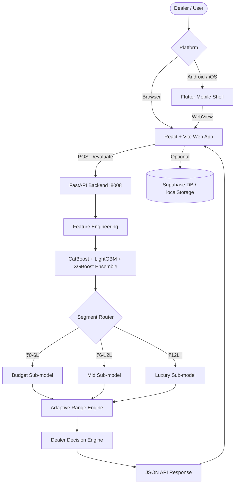

# AutoQuant — AI-Powered Used Vehicle Valuation Engine

> **Data-driven market valuation, acquisition risk assessment, and deal profitability for used vehicles in the Indian market.**

AutoQuant is a full-stack machine learning system that delivers instant vehicle market valuations, dealer buy/sell recommendations, profit estimates, risk scores, and negotiation strategies. Powered by a **CatBoost + LightGBM + XGBoost global ensemble** with price-band segment routing and a data-driven **Adaptive Range Engine**, the system processes vehicle attributes and returns calibrated market insights in milliseconds.

---

## 🔄 System Pipeline



---

## 📊 Model Performance (Variant 1 — Active Default)

### Validation Set Metrics (17,632 train / 3,778 validation rows)

| Model | MAPE | R2 | MAE |
|:---|:---:|:---:|:---:|
| LightGBM | 7.58% | 0.9580 | Rs.44,416 |
| CatBoost | 9.15% | 0.9541 | Rs.57,858 |
| XGBoost | 7.92% | 0.9582 | Rs.47,166 |
| **Ensemble (Active)** | **7.48%** | **0.9607** | **Rs.44,383** |

### Hold-out Test Set Metrics (3,748 unseen rows — zero overlap with train/val)

| Model | MAPE | R2 | MAE | RMSE |
|:---|:---:|:---:|:---:|:---:|
| LightGBM | 7.09% | 0.9646 | Rs.41,851 | Rs.97,753 |
| CatBoost | 9.00% | 0.9537 | Rs.57,814 | Rs.1,37,748 |
| XGBoost | 7.43% | 0.9643 | Rs.44,313 | Rs.1,05,923 |
| **Ensemble** | **7.07%** | **0.9660** | **Rs.42,333** | **Rs.1,01,006** |

### Segment-wise Test Performance (Ensemble)

| Price Band | Test Rows | MAPE | R2 |
|:---|:---:|:---:|:---:|
| **Budget** Rs.0 – 6L | 2,291 | 7.51% | 0.9149 |
| **Mid** Rs.6L – 12L | 1,153 | 6.17% | 0.7619 |
| **Luxury** Rs.12L+ | 325 | 7.12% | 0.6907 |

### Ensemble Weights (Optimizer-derived, Validation Set)

| Algorithm | Weight | Role |
|:---|:---:|:---|
| **LightGBM** | **82.89%** | Primary: mileage, age, km-per-year curves |
| **CatBoost** | **17.11%** | Secondary: brand/model/variant/locality encoding |
| **XGBoost** | **~0.00%** | Included for API compatibility (optimizer zeroed) |

---

## 📁 Dataset Details & Preprocessing

### Three Registered Variants

| Variant | Dataset | Total Rows | Train | Valid | Test | Status |
|:---|:---|:---:|:---:|:---:|:---:|:---:|
| **variant_1** *(active)* | overall_only | 25,158 | 17,632 | 3,778 | 3,748 | Active |
| variant_2 | overall_plus_s5 | 25,340 | 17,775 | 3,789 | 3,776 | Archived |
| variant_3 | s1s4_plus_s5 | 25,371 | 17,773 | 3,819 | 3,779 | Archived |

### Split Strategy

- **70 / 15 / 15** group-stratified by price bucket
- **Price buckets**: Rs.0-3L, Rs.3-5L, Rs.5-10L, Rs.10-15L, Rs.15L+
- **Leak-free**: train/validation/test deduplication verified before save
- **Normalization**: brand, model, and variant strings canonicalized (engine-size badges, fuel-tech suffixes removed) before splitting

### Price Distribution (Variant 1 — overall_only)

| Bucket | Train | Validation | Test |
|:---|:---:|:---:|:---:|
| Rs.0 – 3L | 3,216 | 693 | 673 |
| Rs.3 – 5L | 5,325 | 1,154 | 1,154 |
| Rs.5 – 10L | 6,615 | 1,403 | 1,402 |
| Rs.10 – 15L | 1,850 | 396 | 387 |
| Rs.15L+ | 626 | 132 | 132 |

### Model Features (15 total)

| Type | Features |
|:---|:---|
| **Categorical** (9) | brand, model, variant, locality, rto, fuel_type, transmission, seller_type, color |
| **Numeric** (6) | vehicle_age, odometer_reading, km_per_year, owner_count, certified, pincode |


---

## 🎯 Market Selling Range Logic (AdaptiveRangeEngine)

The market selling range is computed in 5 stages inside `backend/decision_engine.py`:

### Stage 1 — Outlier Filtering (Tukey IQR Fence)
Comparable prices outside `[Q1 - 1.5*IQR, Q3 + 1.5*IQR]` are dropped before range calculation. This prevents extreme outlier listings from distorting the band.

### Stage 2 — Confidence Tier

| Tier | Condition |
|:---|:---|
| **High** | >= 10 comps AND avg similarity >= 75% |
| **Medium** | >= 4 comps AND avg similarity >= 60% |
| **Low** | Everything else |

### Stage 3 — Blended Center Price
Top-5 comps weighted by `sim^6 x owner-weight x odometer-Gaussian`.
Center = `alpha x comp_anchor + (1-alpha) x ML_prediction`
where `alpha` scales linearly from 0.50 to 0.70 as similarity rises from 60% to 75%.

### Stage 4 — Robust Sigma Range

```
sigma = IQR / 1.35        (robust std estimator, equivalent to normal std)
k     = 0.25 (high) or 0.30 (medium)

comp_range = [center - k*sigma,  center + k*sigma]
ml_range   = [center*(1-MAPE),   center*(1+MAPE)]
final_range = alpha * comp_range + (1-alpha) * ml_range
```

Fallback (< 4 comps): pure MAPE band around ML prediction.

### Stage 5 — Hard Width Cap
Maximum range width capped at **8% of center price** (`max_allowed_range_pct = 0.08`). Rounded to nearest Rs.500.

**Typical output**: 7-10% width (e.g. Rs.48K on a Rs.6.26L vehicle = 7.7%).

All parameters tunable in `backend/valuation_config.json` — no code changes needed.

---

## 🔧 Price-Band Segment Routing

After the ensemble prediction, each vehicle is routed to a dedicated CatBoost sub-model:

| Price Band | Train Rows | Val MAPE | Improvement vs Global |
|:---|:---:|:---:|:---:|
| **Budget** Rs.0 – 6L | 10,809 | 8.80% | +8.4% |
| **Mid** Rs.6L – 12L | 5,426 | 5.95% | +27.6% |
| **Luxury** Rs.12L+ | 1,501 | 5.92% | +52.1% |

Segment routing auto-activates when segment MAPE improvement exceeds 5% over the global ensemble.

---

## 🛠️ Backend API (`http://localhost:8008`)

| Endpoint | Method | Description |
|:---|:---:|:---|
| `/evaluate` | POST | Full valuation — market value, buy/sell targets, risk score, recommendation |
| `/evaluate-enhanced` | POST | Evaluation with physical component-grade inspection |
| `/predict` | POST | Lightweight market value + price range |
| `/reverse-calculate` | POST | Max buy price given desired sell price and target margin |
| `/api/options` | GET | Dynamic year/fuel/transmission options for a brand+model |
| `/api/brands` | GET | Canonical brand catalog |
| `/api/catalog` | GET | Full brand -> model -> variant catalog |
| `/api/registry` | GET | Active model variant metadata and metrics |
| `/health` | GET | Server health and loaded model status |
| `/docs` | GET | Interactive Swagger API documentation |

### Dealer Decision Engine (Waterfall Model)

```
Buy Price = Market Value - Recon - Holding - Docs - Risk Buffer - Target Profit
```

- Dynamic margins capped by vehicle category (Economy Rs.40K -> Luxury Rs.85K)
- Negotiation strategy: Opening offer, target offer, walk-away price
- Risk scoring: 0-100 based on mileage, age, owner count, inspection
- Recommendations: BUY, BUY AFTER INSPECTION, NEGOTIATE, REJECT

---

## ⚙️ Configuration

### `backend/valuation_config.json` — Zero-code tuning

| Parameter | Default | Description |
|:---|:---:|:---|
| `max_allowed_range_pct` | 0.08 | Hard cap on range width as fraction of center price |
| `range_sigma.high` | 0.25 | Sigma multiplier k for high-confidence range |
| `range_sigma.medium` | 0.30 | Sigma multiplier k for medium-confidence range |
| `high_confidence_min_comps` | 10 | Min comps needed for high-confidence tier |
| `medium_confidence_min_comps` | 4 | Min comps needed for medium-confidence tier |
| `high_confidence_avg_sim` | 0.75 | Min avg similarity for high-confidence tier |
| `medium_confidence_avg_sim` | 0.60 | Min avg similarity for medium-confidence tier |
| `comp_weight_high` | 0.70 | Max comp blend weight (high similarity) |
| `comp_weight_medium` | 0.50 | Comp blend weight at medium similarity |

### `.env`

```env
VITE_API_URL=http://localhost:8008
VITE_SUPABASE_URL=https://your-project.supabase.co   # optional
VITE_SUPABASE_ANON_KEY=your-anon-key                 # optional
```

---

## 🏁 Quick Start

> No model training required. Pre-trained Variant 1 artifacts are included in `model_registry/variant_1/`.

### Prerequisites
- Python 3.10+
- Node.js 18+
- Flutter SDK 3.44+ *(optional — mobile only)*

### 1. Clone & Install

```bash
git clone https://github.com/UmaDamotharan/Price-Prediction.git
cd Price-Prediction

python -m venv venv
venv\Scripts\activate          # Windows
# source venv/bin/activate     # macOS/Linux

pip install -r backend/requirements.txt
```

### 2. Configure `.env`

```bash
cp .env.example .env
# Set VITE_API_URL=http://localhost:8008
```

### 3. Start Backend

```bash
python -m uvicorn backend.main:app --host 0.0.0.0 --port 8008
# Swagger docs at: http://localhost:8008/docs
```

### 4. Start Frontend

```bash
npm install
npm run dev
# App at: http://localhost:5173
```

### 5. Mobile (Optional)

```bash
npm run build:mobile
cd mobile && flutter pub get && flutter run
```

---

## 📱 Flutter Mobile Shell

```powershell
# Release builds
flutter build apk --release
flutter build appbundle --release
flutter build ios --release

# Custom API URL for device
flutter run --dart-define=API_URL=http://192.168.1.10:8008
```

---

## 🌐 Deployment

### Render.com (Recommended — 1-Click)
1. Fork this repo
2. Sign up at [render.com](https://render.com)
3. **New → Blueprint** → select your fork → **Apply**
4. `render.yaml` auto-configures FastAPI backend + Vite static frontend

### Vercel + Railway
```
Railway: python -m uvicorn backend.main:app --host 0.0.0.0 --port $PORT
Vercel:  Build=npm run build  Output=dist  Env=VITE_API_URL=<railway-url>
```

### Docker
```bash
docker-compose up --build
```

---

## ☁️ Supabase Setup (Optional)

Core ML valuations work 100% offline. Supabase enables user auth and cloud history.

```sql
create table if not exists profiles (
  id uuid references auth.users(id) primary key,
  name text not null,
  avatar text not null default 'U',
  role text not null default 'Dealer',
  created_at timestamptz default now()
);

create table if not exists evaluations (
  id text primary key,
  user_id uuid references auth.users(id) on delete cascade,
  created_at timestamptz default now(),
  source text, brand text, model text, year int,
  fuel text, transmission text, city text,
  odometer int, owner_count int, condition text,
  seller_asking_price numeric, market_value numeric,
  buy_price numeric, sell_price numeric,
  expected_profit numeric, margin_pct numeric,
  risk_score numeric, confidence_score numeric,
  action text, is_ml_powered boolean,
  positive_factors jsonb, negative_factors jsonb
);

alter table profiles   enable row level security;
alter table evaluations enable row level security;

create policy "own profile read"   on profiles   for select using (auth.uid() = id);
create policy "own profile insert" on profiles   for insert with check (auth.uid() = id);
create policy "own evals read"     on evaluations for select using (auth.uid() = user_id);
create policy "own evals insert"   on evaluations for insert with check (auth.uid() = user_id);
```

---

## 🔬 Retraining (Optional)

```bash
# Step 1: Prepare stratified splits for all datasets
python ml_training/prepare_splits.py

# Step 2: Train variant (set VARIANT env var or edit train-1.py)
python ml_training/train-1.py   # writes to model_registry/variant_N/

# Step 3: Validate
python scripts/validate_models.py
python scripts/system_health_check.py

# Step 4: Regenerate engine config (locality demand, market percentiles)
python scripts/generate_engine_config.py
```

---

## 🛡️ Diagnostic Scripts (`scripts/`)

| Script | Description |
|:---|:---|
| `system_health_check.py` | Validates model files, imports, engine logic, mock valuations |
| `validate_models.py` | Prediction verification across all variant artifacts |
| `generate_engine_config.py` | Regenerates market percentiles and locality demand tables |
| `show_buy_price.py` | Interactive CLI for buy price / margin / risk calculation |
| `feature_sensitivity_test.py` | Tests model sensitivity to individual feature changes |

---

## 📂 Project Structure

```
Price-Prediction/
├── backend/
│   ├── main.py                  # FastAPI app, endpoints, feature engineering
│   ├── decision_engine.py       # AdaptiveRangeEngine, ConfidenceEngine, DecisionEngine
│   ├── ensemble_predictor.py    # Model loader and ensemble predictor
│   ├── valuation_config.json    # All tunable engine parameters
│   └── engine_config.json       # Auto-generated market stats and locality data
├── ml_training/
│   ├── prepare_splits.py        # 70/15/15 stratified data splitting pipeline
│   ├── train-1.py               # Main ensemble training script
│   ├── clean_datasets.py        # Brand/model/variant normalization
│   └── data/                    # Train/valid/test CSVs per dataset variant
├── model_registry/
│   ├── registry.json            # Active variant pointer and metrics index
│   └── variant_1/               # Pre-trained artifacts (ensemble + 3 segment models)
├── src/                         # React + Vite frontend source
├── mobile/                      # Flutter cross-platform shell
├── scripts/                     # Diagnostic and operational utilities
├── .env                         # VITE_API_URL and Supabase keys
├── render.yaml                  # 1-click Render deployment blueprint
└── vite.config.js               # Frontend build configuration
```
