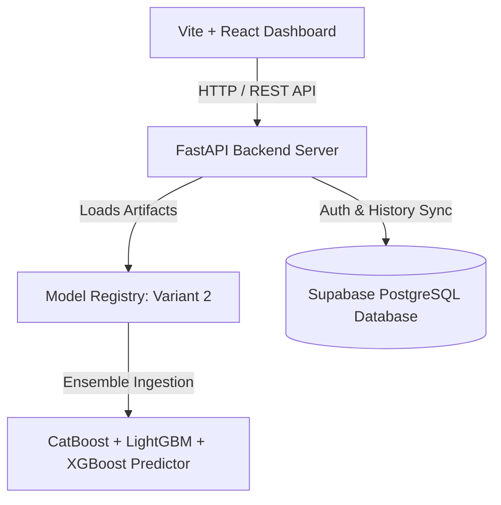

# Autopricer — AI-Powered Used Vehicle Valuation Engine

> **Data-driven valuation, acquisition risk assessment, and deal profitability for used vehicles.**

Autopricer is a high-performance machine learning system built for instant vehicle valuation, profit estimation, acquisition risk scoring, and negotiation strategy calculation. Powered by a specialized **CatBoost, LightGBM, and XGBoost ensemble (Variant 2)**, Autopricer processes vehicle attributes and returns market valuations in milliseconds.

---

## 🚀 Model Architecture & Build Details (Variant 2)

Autopricer is built on the **Variant 2 Model Architecture**, which achieved the highest overall accuracy across dataset benchmarks:

| Metric | Benchmark Value |
| :--- | :--- |
| **Active Model** | `Variant 2 Ensemble` |
| **MAPE (Mean Absolute Percentage Error)** | **6.28%** |
| **R² Score** | **0.976** |
| **MAE (Mean Absolute Error)** | **₹37,988** |
| **RMSE** | **₹75,207** |
| **Model Registry Path** | `model_registry/variant_2` |

### Ensemble Components
1. **CatBoost Regressor**: Primary categorical feature processing (Brand, Model, Trim Variant, City, Transmission).
2. **LightGBM Booster**: High-efficiency gradient boosting for continuous interactions (Age, Mileage, Age-KM interactions).
3. **XGBoost Regressor**: Residual error correction and price boundary alignment.
4. **Price-Band Routing Sub-models**: Dedicated sub-models for `₹6L–₹12L` and `₹12L+` vehicle brackets.

---

## 🛠️ System Architecture & Connection Flow



### Connection Details
* **Frontend**: React (Vite) running on `http://localhost:5173` (or production port).
* **Backend API**: FastAPI server running on `http://127.0.0.1:8000` (`http://localhost:8000`).
* **Swagger API Docs**: `http://localhost:8000/docs`.

---

## 📋 API Endpoints

| Endpoint | Method | Description |
| :--- | :--- | :--- |
| `/evaluate` | `POST` | Core ML valuation request — returns Market Value, Buy/Sell targets, Risk score, and Recommendation. |
| `/evaluate-enhanced` | `POST` | Comprehensive evaluation incorporating physical grade inspection and component condition. |
| `/predict` | `POST` | Fast ML market value prediction with price range bounds. |
| `/reverse-calculate` | `POST` | Calculates maximum buy price target given a desired sell price and profit margin. |
| `/api/brands` | `GET` | Fetches canonical brand catalog and valid models. |
| `/api/registry` | `GET` | Returns active model variant configuration (**Variant 2**). |

---

## 🏁 Quick Start

### Prerequisites
* **Python 3.10+**
* **Node.js 18+**
* **Git**

### 1. Clone & Set Up Backend

```bash
# Clone repository
git clone https://github.com/Hars03082005/Autopricer.git
cd Autopricer

# Create and activate Python virtual environment
python -m venv venv
# On Windows:
venv\Scripts\activate
# On macOS/Linux:
source venv/bin/activate

# Install Python backend dependencies
pip install -r backend/requirements.txt
```

### 2. Configure Environment Variables

Create a `.env` file in the root directory:

```env
VITE_SUPABASE_URL=your_supabase_url
VITE_SUPABASE_ANON_KEY=your_supabase_anon_key
ACTIVE_VARIANT_ID=variant_2
```

### 3. Run FastAPI Backend

```bash
uvicorn backend.main:app --reload --port 8000
```
Backend will start at `http://127.0.0.1:8000`.

### 4. Install & Run Frontend UI

Open a second terminal:

```bash
# Install Node dependencies
npm install

# Start Vite React development server
npm run dev
```
Frontend will start at `http://localhost:5173`.

---

## 🔬 Model Training & Cleaning Scripts (Variant 2)

To clean data and train Variant 2 from scratch:

```bash
# 1. Clean dataset for Variant 2
python ml_training/clean_data-1.py

# 2. Train Variant 2 Ensemble Model
python ml_training/train-1.py
```

*Note: Training outputs are saved directly into `model_registry/variant_2`.*

---

## 📄 License
MIT License. Built for Autopricer Used Vehicle Valuation Systems.
