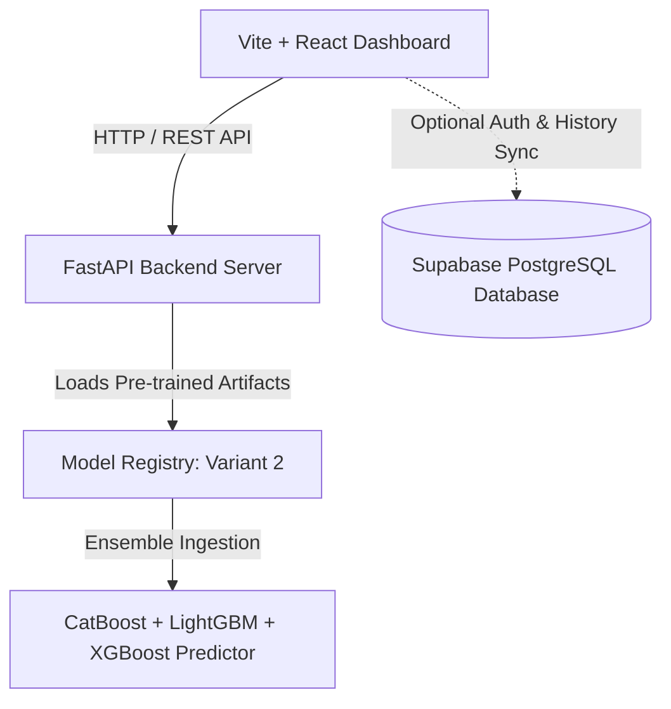

# Autopricer — AI-Powered Used Vehicle Valuation Engine

> **Data-driven valuation, acquisition risk assessment, and deal profitability for used vehicles.**

Autopricer is a high-performance machine learning system built for instant vehicle valuation, profit estimation, acquisition risk scoring, and negotiation strategy calculation. Powered by a specialized **CatBoost, LightGBM, and XGBoost ensemble (Variant 2)**, Autopricer processes vehicle attributes and returns market valuations in milliseconds.

---

## 🚀 Model Architecture & Build Details (Variant 2)

Autopricer comes pre-packaged with **Variant 2 Model Artifacts** in `model_registry/variant_2`. No training or dataset setup is needed to run the app out of the box.

| Metric | Benchmark Value |
| :--- | :--- |
| **Active Model** | `Variant 2 Ensemble` *(Pre-trained & ready)* |
| **MAPE (Mean Absolute Percentage Error)** | **6.28%** |
| **R² Score** | **0.976** |
| **MAE (Mean Absolute Error)** | **₹37,988** |
| **RMSE** | **₹75,207** |
| **Model Registry Path** | `model_registry/variant_2` |

### Ensemble Components
1. **CatBoost Regressor**: Primary categorical feature processing (Brand, Model, Trim Variant, City, Transmission).
2. **LightGBM Booster**: High-efficiency gradient boosting for continuous interactions (Age, Mileage, Age-KM interactions).
3. **XGBoost Regressor**: Residual error correction and price boundary alignment.
4. **Price-Band Routing Sub-models**: Dedicated sub-models for `₹6L–₹12L` and `₹12L+` vehicle brackets.

---

## 🛠️ System Architecture & Connection Flow



### Connection Details
* **Frontend**: React (Vite) running on `http://localhost:5173` (or production port).
* **Backend API**: FastAPI server running on `http://127.0.0.1:8000` (`http://localhost:8000`).
* **Swagger API Docs**: `http://localhost:8000/docs`.

---

## 📋 API Endpoints

| Endpoint | Method | Description |
| :--- | :--- | :--- |
| `/evaluate` | `POST` | Core ML valuation request — returns Market Value, Buy/Sell targets, Risk score, and Recommendation. |
| `/evaluate-enhanced` | `POST` | Comprehensive evaluation incorporating physical grade inspection and component condition. |
| `/predict` | `POST` | Fast ML market value prediction with price range bounds. |
| `/reverse-calculate` | `POST` | Calculates maximum buy price target given a desired sell price and profit margin. |
| `/api/brands` | `GET` | Fetches canonical brand catalog and valid models. |
| `/api/registry` | `GET` | Returns active model variant configuration (**Variant 2**). |

---

## 🏁 Quick Start (Run Out of the Box)

> 💡 **No model training is required after cloning.** The pre-trained Variant 2 model artifacts are included directly in `model_registry/variant_2`.

### Prerequisites
* **Python 3.10+**
* **Node.js 18+**
* **Git**

### 1. Clone & Set Up Backend

```bash
# Clone repository
git clone https://github.com/Hars03082005/Autopricer.git
cd Autopricer

# Create and activate Python virtual environment
python -m venv venv
# On Windows:
venv\Scripts\activate
# On macOS/Linux:
source venv/bin/activate

# Install Python backend dependencies
pip install -r backend/requirements.txt
```

### 2. Configure Environment Variables (Optional for Supabase)

Copy `.env.example` to `.env`:

```bash
cp .env.example .env
```

Or create `.env` manually:

```env
VITE_SUPABASE_URL=your_supabase_url
VITE_SUPABASE_ANON_KEY=your_supabase_anon_key
ACTIVE_VARIANT_ID=variant_2
```

### 3. Run FastAPI Backend

```bash
uvicorn backend.main:app --reload --port 8000
```
Backend will start at `http://127.0.0.1:8000` and load pre-trained Variant 2 models automatically.

### 4. Install & Run Frontend UI

Open a second terminal:

```bash
# Install Node dependencies
npm install

# Start Vite React development server
npm run dev
```
Frontend will start at `http://localhost:5173`.

---

## 🌐 Deployment & Hosting Guide

Anyone cloning this repository can deploy it online using any of the following methods:

### **Method 1: Render.com (Recommended — 1-Click Auto Blueprint)**

Since `render.yaml` is pre-configured in this repository:

1. Fork or push this repository to your GitHub account.
2. Sign up at **[render.com](https://render.com)**.
3. Click **New + → Blueprint** and select your repository.
4. Click **Apply**. Render will automatically deploy:
   - **Backend Web Service**: Python FastAPI + Uvicorn server (`price-prediction-backend`).
   - **Frontend Static Site**: React Vite bundle (`price-prediction-frontend`).

---

### **Method 2: Vercel (Frontend) + Railway (Backend)**

1. **Backend (Railway.app):**
   - New Project → Deploy from GitHub → Select Repository.
   - Set Start Command: `python -m uvicorn backend.main:app --host 0.0.0.0 --port $PORT`
2. **Frontend (Vercel.com):**
   - New Project → Import GitHub Repo.
   - Build Command: `npm run build`, Output Directory: `dist`.
   - Add Environment Variable: `VITE_API_URL=https://your-backend-railway-url.up.railway.app`

---

### **Method 3: Docker Deployment**

Run using Docker locally or on any Cloud VPS (AWS / DigitalOcean / Hetzner):

```bash
# Build & Run using docker-compose
docker-compose up --build
```

---

## ⚡ Supabase Setup (Optional — User Accounts & History Sync)

> **Note:** Core ML valuations work **100% offline without Supabase**. Supabase is only required if you want user authentication (login/signup) and persistent cloud evaluation history.

To enable Supabase integration:

1. Create a free project at [supabase.com](https://supabase.com).
2. Copy your project **URL** and **anon Key** into `.env`:
   ```env
   VITE_SUPABASE_URL=https://your-project.supabase.co
   VITE_SUPABASE_ANON_KEY=your-anon-key
   ```
3. Run this SQL in your Supabase **SQL Editor**:

```sql
-- User Profiles
create table if not exists profiles (
  id uuid references auth.users(id) primary key,
  name text not null,
  avatar text not null default 'U',
  role text not null default 'Dealer',
  created_at timestamptz default now()
);

-- Valuation History
create table if not exists evaluations (
  id text primary key,
  user_id uuid references auth.users(id) on delete cascade,
  created_at timestamptz default now(),
  source text, brand text, model text, year int,
  fuel text, transmission text, city text,
  odometer int, fuel_efficiency numeric, owner_count int,
  engine_cc int, condition text, seller_asking_price numeric,
  market_value numeric, buy_price numeric, sell_price numeric,
  expected_profit numeric, margin_pct numeric, risk_score numeric,
  confidence_score numeric, deal_quality_score numeric, action text,
  urgency_score numeric, is_ml_powered boolean,
  positive_factors jsonb, negative_factors jsonb
);

-- Enable RLS
alter table profiles enable row level security;
alter table evaluations enable row level security;

create policy "own profile read"   on profiles   for select using (auth.uid() = id);
create policy "own profile insert" on profiles   for insert with check (auth.uid() = id);
create policy "own evals read"     on evaluations for select using (auth.uid() = user_id);
create policy "own evals insert"   on evaluations for insert with check (auth.uid() = user_id);
```

---

## 🔬 Optional: Retraining Model Variant 2 

> **Note:** This section is completely optional. The app runs immediately without running these scripts.

If you wish to clean a raw dataset and retrain Variant 2 from scratch in the future:

```bash
# 1. Clean raw dataset for Variant 2
python ml_training/clean_data-1.py

# 2. Train Variant 2 Ensemble Model
python ml_training/train-1.py
```

*Note: Training outputs will update `model_registry/variant_2`.*
