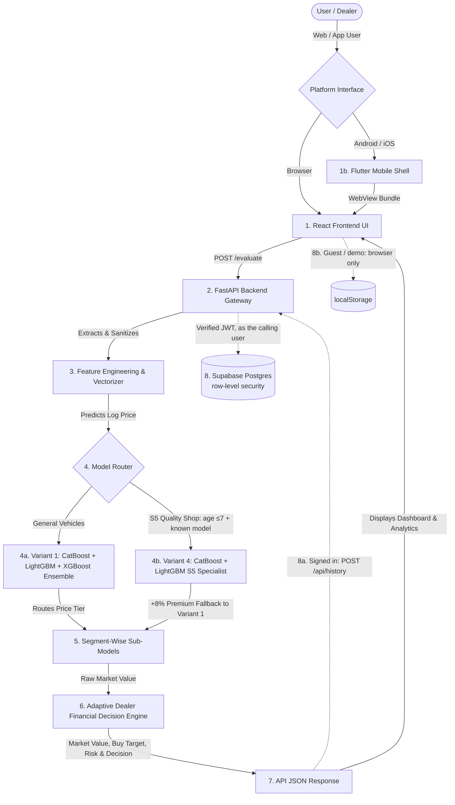
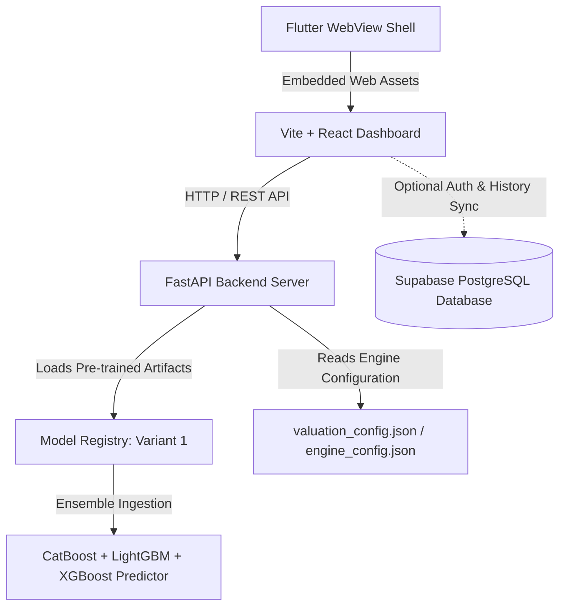
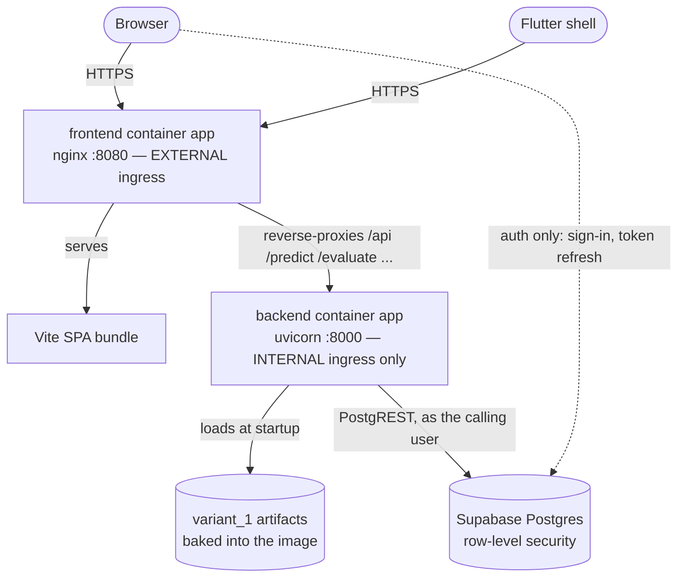

# PriceRef — AI-Powered Used Vehicle Valuation Engine

> **Data-driven valuation, acquisition risk assessment, and deal profitability for used vehicles.**

PriceRef is a high-performance machine learning system built for instant vehicle valuation, profit estimation, acquisition risk scoring, and negotiation strategy calculation. Powered by a **dual-mode ML architecture** — a **CatBoost + LightGBM + XGBoost global ensemble (Variant 1)** for broad market coverage, and a **specialized CatBoost + LightGBM S5 model (Variant 4)** for quality shop premium vehicles — PriceRef processes vehicle attributes and returns market valuations in milliseconds across Web and Mobile platforms.

---

## 🔄 Full End-to-End Project Pipeline

PriceRef connects a responsive React frontend, a Flutter mobile shell, a FastAPI REST service, an ML ensemble model, an adaptive financial decision engine, and an optional cloud persistence layer into a single unified workflow:



### 1. User Interface & Data Ingestion
- **React + Vite Web App**: Supports Single Vehicle Evaluation, Enhanced Multi-Grade Inspection, VIN Lookup, Bulk Batch Evaluation, AI Dealer Assistant, and Reverse Price Calculation.
- **Flutter Mobile Shell (`mobile/`)**: Native cross-platform mobile application wrapping the Vite build in an embedded WebView with seamless API URL injection.
- **Client Sanitization**: Automatically normalizes user inputs (trim spacing, title-casing brand/model names, fuel type conversion) before constructing API payloads.

### 2. API Gateway & Request Routing (FastAPI REST API)
- High-throughput asynchronous Python web server exposing structured endpoints:
  - `/evaluate`: Standard ML valuation, risk scoring, and profitability breakdown.
  - `/evaluate-enhanced`: Comprehensive evaluation incorporating component grades (Engine, Tyres, Body, Interior, Electricals).
  - `/predict`: Lightweight valuation endpoint returning target market value and soft physical range bounds.
  - `/reverse-calculate`: Computes maximum buy price target given a desired sell price and profit margin.
  - `/api/brands`: Fetches canonical brand catalog and valid model variants.
  - `/api/registry`: Returns active model variant configuration (**Variant 1**).

### 3. Feature Construction & Normalization Pipeline (`backend/main.py`)
- Constructs a 23-column feature DataFrame (`build_features`) in real time:
  - **Categorical Features**: `brand`, `model`, `variant` (trim), `city`, `locality`, `rto`, `segment_class`, `fuel_type`, `transmission`, `seller_type`.
  - **Engineered Numeric Features**: `vehicle_age`, `odometer_reading`, `km_per_year`, `owner_count`, `brand_tier`, `age_km_interaction`, `ownership_trust_score`, `vehicle_health_score`, `locality_tier`, `usage_category_num`, `locality_density_norm`, `popularity_score_log`.

### 4a. Variant 1 — Global Weighted ML Ensemble (Default)
- Predicts log-transformed price $\hat{y}_{\text{log}}$ using optimized model weights:
  $$\hat{y}_{\text{ensemble}} = 0.8918 \times \hat{y}_{\text{LightGBM}} + 0.1082 \times \hat{y}_{\text{CatBoost}} + 0.0000 \times \hat{y}_{\text{XGBoost}}$$
- **LightGBM (89.18% Weight)**: Processes continuous splits, age-km interaction features, and vehicle usage curves.
- **CatBoost (10.82% Weight)**: Handles high-cardinality categorical target encoding for brand, model, and trim combinations.
- **XGBoost (0.00% Weight)**: Included for API compatibility; optimizer assigns zero weight.

### 4b. Variant 4 — S5 Quality Shop Specialist Model
- Activated **only** when `vehicle_age ≤ 7` **AND** the vehicle's brand/model is present in the S5 catalog.
- Small-dataset (173 rows) two-model ensemble trained with heavy regularization to prevent overfitting:
  $$\hat{y}_{\text{S5}} = 0.8061 \times \hat{y}_{\text{CatBoost}} + 0.1939 \times \hat{y}_{\text{LightGBM}}$$
- **CatBoost (80.61% Weight)**: Primary model for high-cardinality brand/model/trim encoding on premium vehicles.
- **LightGBM (19.39% Weight)**: Supports age-mileage curve fitting on young, low-odometer quality stock.
- **Fallback Rule**: When the vehicle is not found in the S5 catalog, falls back to Variant 1 with a `+8% quality premium` applied.
- **Training Script**: `ml_training/train-s5.py` | **Dataset**: `processed_s5.csv` (173 rows, age 0–7 years)

### 5. Price-Band Segment Routing
- Evaluates the initial ensemble quote and routes the vehicle into dedicated price-tier CatBoost sub-models:
  - **Budget Tier (`₹0 – ₹6 Lakhs`)**: `segment_0_6_lakh.cbm`
  - **Mid Tier (`₹6 Lakhs – ₹12 Lakhs`)**: `segment_6_12_lakh.cbm`
  - **Luxury Tier (`₹12 Lakhs+`)**: `segment_12_plus_lakh.cbm`

### 6. Dealer Financial Decision Engine (`backend/decision_engine.py`)
- **Market Value Calculation**: Converts log price back to INR using $\text{Price} = \exp(\hat{y}_{\text{log}}) - 1$, rounded to the nearest ₹500 step.
- **Configurable Adaptive Parameters (`backend/valuation_config.json`)**: Allows zero-code tuning of similarity weights, age/odometer sigmas, confidence limits, and luxury brand thresholds.
- **Dealer Waterfall Model**:
  $$\text{Recommended Buy Price} = \text{Market Value} \times (1 - \text{Margin \%}) - \text{Recon Costs} - \text{Holding/Risk Buffer}$$
- **Locality & RTO Demand Adjustment**: Dynamic geographic price micro-tuning based on intracity demand signals.
- **Risk & Confidence Engine**: Computes Risk Score (0–100 based on mileage, age, owner count, physical inspection) and Confidence Score (0–100 based on comparable market matches and dataset density).
- **Decision Output**: Generates clear dealer actions (`BUY`, `BUY AFTER INSPECTION`, `NEGOTIATE`, `REJECT`).

### 7. Interactive Response Rendering
- Renders key financial metrics, price range visualizers, risk breakdown gauges, negotiation opening/walk-away targets, and counterfactual insights on both web and mobile dashboards.

### 8. Persistence & Dual-Mode History Sync
- **Authenticated Mode**: Completed valuations are persisted through the API
  (`POST /api/history`), not written from the browser. FastAPI verifies the
  Supabase access token and issues the query **as that user**, so row-level
  security still applies — see [How persistence works now](#how-persistence-works-now).
  The server owns the row id, the timestamp and the owner, so none of the three
  can be supplied by a client.
- **Guest / Demo Mode**: History stays in browser `localStorage` and the database
  is not touched. Guests have no `auth.users` row and therefore no id to own
  records; the previous behaviour of writing `user_id: 'guest'` into a `uuid`
  column failed on every attempt.
- **Degraded Mode**: If Supabase is unconfigured or unreachable, valuations keep
  working and the UI reports that history was saved locally only, rather than
  implying it reached the cloud.

---

## 📊 Complete Model Results & Benchmarks

PriceRef ships with **all 4 trained model variants** in `model_registry/`.

### 1. Variant 1 — Global Ensemble Metrics (Active Default)

| Metric | Result | Benchmark Quality |
| :--- | :---: | :--- |
| **Active Engine** | `Variant 1 Ensemble` | Active Default |
| **MAPE (Mean Absolute Percentage Error)** | **`6.16%`** | 🌟 Top Precision (< 6.2% error) |
| **R² Score (Variance Explained)** | **`0.9777` (97.77%)** | 🎯 High Overall Accuracy |
| **MAE (Mean Absolute Error)** | **`₹38,273`** | Average deviation per quote |
| **RMSE (Root Mean Squared Error)** | **`₹98,254`** | Outlier-penalized error |
| **Training Dataset** | `processed_overall.csv` | 33,979 listings |

### 2. Variant 1 — Weighted Ensemble Breakdown

| Base Algorithm | Ensemble Weight (%) | Primary Feature Focus |
| :--- | :---: | :--- |
| ⚡ **LightGBM** | **`89.18%`** | Age, Mileage, Age-KM Interactions, Health Scores |
| 🐱 **CatBoost** | **`10.82%`** | Brand, Model, Trim Variant, City, Locality, RTO |
| 🚀 **XGBoost** | **`0.00%`** | Included for API compatibility (optimizer zeroed out) |

### 3. Segment-wise Price-Band Routing Metrics (Variant 1)

| Price Segment Bracket | Dataset Size (Listings) | Segment MAPE | Segment R² | Active Model File |
| :--- | :---: | :---: | :---: | :--- |
| **Budget Tier** (`₹0 – ₹6 Lakhs`) | 11,941 listings | **`8.14%`** | **`0.9154`** | `segment_0_6_lakh.cbm` |
| **Mid Tier** (`₹6L – ₹12 Lakhs`) | 6,525 listings | **`5.64%`** | **`0.8522`** | `segment_6_12_lakh.cbm` |
| **Luxury / High-Value** (`₹12L+`) | 1,993 listings | **`5.09%`** | **`0.8872`** | `segment_12_plus_lakh.cbm` |

### 4. Variant 4 — S5 Quality Shop Specialist Metrics

> **Activation Condition**: `vehicle_age ≤ 7` AND vehicle brand/model exists in S5 catalog.
> Falls back to Variant 1 + 8% premium for vehicles not in S5 catalog.

| Metric | Result | Notes |
| :--- | :---: | :--- |
| **Model Type** | `CatBoost + LightGBM` | No XGBoost (too few rows) |
| **MAPE** | **`16.38%`** | Expected — small dataset (173 rows) |
| **R² Score** | **`0.3429`** | Narrow specialty scope, not general market |
| **MAE** | **`₹2,72,324`** | Premium segment vehicles |
| **RMSE** | **`₹5,04,875`** | High-value vehicle spread |
| **Training Rows** | `138 train / 35 val` | 80/20 split from 173 total rows |
| **Ensemble Weights** | CatBoost 80.61% / LightGBM 19.39% | Optimizer favors CatBoost on small data |
| **Training Dataset** | `processed_s5.csv` | S5 quality shop listings, age 0–7 years |

### 5. Registered Variant Benchmark Comparison

| Rank | Model Variant | Training Dataset | MAPE (%) | R² Score | MAE (₹) | RMSE (₹) | System Status |
| :---: | :--- | :--- | :---: | :---: | :---: | :---: | :--- |
| 🥇 **1** | **`variant_1` (Default)** | `processed_overall.csv` | **`6.16%`** | **`0.9777`** | **₹38,273** | **₹98,254** | **Active Default** |
| 🥈 **2** | **`variant_3`** | `processed_s1_s4_owner_1.csv` | **`6.50%`** | **`0.9755`** | **₹39,829** | **₹79,227** | Archived Variant |
| 🥉 **3** | **`variant_2`** | `processed_s1_s4_owner.csv` | **`6.67%`** | **`0.9741`** | **₹40,661** | **₹83,619** | Archived Variant |
| 🏅 **4** | **`variant_4` (S5 Specialist)** | `processed_s5.csv` | **`16.38%`** | **`0.3429`** | **₹2,72,324** | **₹5,04,875** | **S5 Quality Active** |

---

## 📱 Flutter Mobile Application (`mobile/`)

PriceRef includes a dedicated **Flutter cross-platform shell** located in `mobile/`. It wraps the compiled React web bundle into a native WebView container for deployment on Android and iOS devices.

### Mobile Build & Execution Pipeline

```powershell
# 1. Bundle web UI for mobile
npm run build:mobile

# 2. Run Flutter app on Android emulator
cd mobile
flutter pub get
flutter run

# 3. Run on a physical device connected to your network
flutter run --dart-define=API_URL=http://192.168.1.10:8000

# 4. Generate Production Release Packages
flutter build apk --release
flutter build appbundle --release
flutter build ios --release
```

### Mobile Configuration Flags (`--dart-define`)

| Configuration Flag | Description | Default Value |
| :--- | :--- | :--- |
| `API_URL` | FastAPI backend base URL accessible by emulator/device | `http://10.0.2.2:8000` (Android) / `http://localhost:8000` (iOS) |
| `WEB_URL` | Development live-reload server URL (optional) | Bundled `assets/web/` |

---

## 🛠️ System Architecture & Connection Flow



### Connection Details
* **Frontend Web**: React (Vite) running on `http://localhost:5173`.
* **Mobile Shell**: Flutter app running on Android / iOS device.
* **Backend API**: FastAPI server running on `http://127.0.0.1:8000`.
* **Swagger API Docs**: `http://localhost:8000/docs`.

---

## 📋 API Endpoints

| Endpoint | Method | Description |
| :--- | :--- | :--- |
| `/evaluate` | `POST` | Core ML valuation request — returns Market Value, Buy/Sell targets, Risk score, and Recommendation. |
| `/evaluate-enhanced` | `POST` | Comprehensive evaluation incorporating physical grade inspection and component condition. |
| `/predict` | `POST` | Fast ML market value prediction with price range bounds. |
| `/reverse-calculate` | `POST` | Calculates maximum buy price target given a desired sell price and profit margin. |
| `/api/brands` | `GET` | Fetches canonical brand catalog and valid models. |
| `/api/registry` | `GET` | Returns active model variant configuration (**Variant 1**). |

---

## ⚙️ Configuration & Utility Scripts

### Configurable Engine Parameters (`backend/valuation_config.json`)
The adaptive decision engine allows zero-code adjustment of similarity weights and thresholds without code modification:
- `similarity_weights`: Feature weights for brand, model, variant, age, odometer, fuel, locality, transmission, owner count.
- `luxury_brands`: Explicit list of luxury brands receiving tailored geographic dampening and similarity thresholds.
- `confidence_weights` & `confidence_labels`: Tuning confidence score ranges and market support thresholds.

### Diagnostic & Operational Helper Scripts (`scripts/`)

| Script File | Command | Description |
| :--- | :--- | :--- |
| `system_health_check.py` | `python scripts/system_health_check.py` | Validates model files, backend imports, decision engine logic, and mock valuation requests. |
| `validate_models.py` | `python scripts/validate_models.py` | Runs automated prediction verification across all variant artifacts. |
| `generate_engine_config.py` | `python scripts/generate_engine_config.py` | Regenerates statistical market percentiles and locality demand tables into `engine_config.json`. |
| `show_buy_price.py` | `python scripts/show_buy_price.py` | CLI tool to calculate dealer buy prices, margins, and risk buffers interactively. |
| `feature_sensitivity_test.py` | `python scripts/feature_sensitivity_test.py` | Tests model sensitivity to individual feature changes (mileage, age, condition). |

---

## 🏁 Quick Start

> 💡 **No model training is required after cloning.** The pre-trained Variant 1 model artifacts are included directly in `model_registry/variant_1`.

**The containerised path is the recommended one** — it is what CI builds and what
Azure runs, so "works on my machine" and "works in production" mean the same thing:

```bash
cp .env.example .env      # optional: fill in SUPABASE_* for sign-in and cloud history
docker compose up --build
# → http://localhost:5173
```

The first build takes several minutes (the ML dependency tree is ~1 GB) and the
backend needs 30–60 seconds after start to load its models — `docker compose`
waits for the healthcheck before the frontend accepts traffic.

See [Containerised Deployment](#-containerised-deployment-azure-container-apps)
for the full architecture, or continue below to run the services directly on your
machine.

### Prerequisites

| Path | Requirements |
| :--- | :--- |
| **Containers (recommended)** | Docker Desktop / Docker Engine with Compose v2 |
| **Direct** | Python 3.11, Node.js 20+, Git |
| **Mobile (optional)** | Flutter SDK 3.44+ |

> Python **3.11** specifically: `.python-version` and the container image both pin
> it, and `backend/requirements.lock` is resolved against CPython 3.11 on
> linux/amd64.

### 1. Clone & Set Up Backend

```bash
# Clone repository
git clone https://github.com/srinvaid/PriceRefPES.git
cd PriceRefPES

# Create and activate Python virtual environment
python -m venv venv
# On Windows:
venv\Scripts\activate
# On macOS/Linux:
source venv/bin/activate

# Install Python backend dependencies
pip install -r backend/requirements.txt
```

### 2. Configure Environment Variables (Optional for Supabase)

```bash
cp .env.example .env
```

`.env.example` documents every variable inline. Nothing is required to run
valuations — Supabase only adds sign-in and cloud history.

> ⚠️ `ACTIVE_VARIANT_ID` previously defaulted to `variant_7` here, which does not
> exist (the registry holds `variant_1`–`variant_4`). The backend silently fell
> back to a different artifact path rather than failing, so the deployment served
> a model nobody had selected. It is now `variant_1`, and startup aborts if the
> named variant is not the one that loaded.

### 3. Run FastAPI Backend

```bash
uvicorn backend.main:app --reload --port 8000
```
Backend will start at `http://127.0.0.1:8000` and load pre-trained Variant 1 models automatically.

### 4. Install & Run Frontend Web UI

Open a second terminal:

```bash
# Install Node dependencies
npm install

# Start Vite React development server
npm run dev
```
Frontend will start at `http://localhost:5173`.

### 5. Build & Run Mobile Shell (Optional)

Open a third terminal:

```bash
# Bundle React web assets for mobile WebView
npm run build:mobile

# Launch Flutter mobile application
cd mobile
flutter pub get
flutter run
```

---

## 🍴 How to Fork this Repository

If you want to create your own copy of this repository on GitHub to customize or host under your account:

1. Click the **`Fork`** button at the top right of [`github.com/srinvaid/PriceRefPES`](https://github.com/srinvaid/PriceRefPES).
2. Select your account to create an independent copy under your GitHub profile.
3. Follow [Containerised Deployment](#-containerised-deployment-azure-container-apps)
   to point it at your own Azure subscription — the OIDC federated credential is
   scoped to a specific `owner/repo`, so a fork needs its own credential and its
   own repository variables.

> The upstream project this was derived from is
> [`UmaDamotharan/Price-Prediction`](https://github.com/UmaDamotharan/Price-Prediction).
> One-click deploys to Render, Railway or Vercel are no longer the supported
> path; see [Deploying elsewhere](#deploying-elsewhere) for why.

---

## 🐳 Containerised Deployment (Azure Container Apps)

### Architecture



Three decisions worth knowing about, because they shape everything else:

**1. The ML API has no public endpoint.** The backend container app uses
*internal* ingress, so it is addressable only from inside the Container Apps
environment. All browser and mobile traffic arrives at the frontend, whose nginx
reverse-proxies the API paths. Consequences: production needs no CORS at all
(everything is same-origin), and the model, the registry admin route and the
history endpoints are not directly reachable from the internet. The mobile shell
points `API_URL` at the frontend FQDN and is proxied like any browser.

**2. One image, promoted unchanged.** Vite inlines `import.meta.env.VITE_*` at
build time, which normally forces a separate build per environment. Instead the
frontend container writes `/config.js` from its environment on every boot
(`docker/frontend-entrypoint.sh`), so the exact artifact that passed staging is
what reaches production. Images are tagged with the git SHA; there is no `latest`.

**3. Scale with replicas, never workers.** Each uvicorn worker loads its own
~250 MB copy of the ensemble, so the container runs a single worker with
single-threaded BLAS and horizontal scaling does the rest. `minReplicas` is 1
(2 in production): scale-to-zero would make the first request after an idle
period wait through a full model load.

### One-time setup

```bash
# 1. Azure identity for GitHub Actions — OIDC federation, no stored secrets
az ad app create --display-name priceref-github
az ad app federated-credential create --id <appId> --parameters '{
  "name": "github-main",
  "issuer": "https://token.actions.githubusercontent.com",
  "subject": "repo:<owner>/<repo>:ref:refs/heads/main",
  "audiences": ["api://AzureADTokenExchange"]
}'
# Two roles, not one. infra/main.bicep creates the AcrPull assignment that lets
# the container apps pull images, and writing a role assignment needs
# Microsoft.Authorization/roleAssignments/write — which Contributor does not
# have. Without the second grant the first deploy fails AuthorizationFailed.
az role assignment create --assignee <appId> --role Contributor \
  --scope /subscriptions/<sub>/resourceGroups/<rg>
az role assignment create --assignee <appId> \
  --role 'Role Based Access Control Administrator' \
  --scope /subscriptions/<sub>/resourceGroups/<rg>

# 2. Provision infrastructure (also runs from CI; idempotent)
az deployment group create -g <rg> -f infra/main.bicep \
  -p environmentName=staging imageTag=<git-sha> \
     supabaseUrl=https://<ref>.supabase.co supabaseAnonKey=<anon-key>
```

Then configure GitHub — repository **variables** `AZURE_CLIENT_ID`,
`AZURE_TENANT_ID`, `AZURE_SUBSCRIPTION_ID`, and per-**environment** secrets
(`staging`, `production`): `AZURE_RESOURCE_GROUP`, `SUPABASE_URL`,
`SUPABASE_ANON_KEY`, `SUPABASE_PROJECT_REF`, `SUPABASE_DB_PASSWORD`,
`SUPABASE_ACCESS_TOKEN`, and `SUPABASE_JWT_SECRET` only if the project still uses
legacy HS256 signing.

**Gating production.** Production deploys only from an explicit
`workflow_dispatch` run with `promote_to_production` ticked — it never happens on
a push. Required reviewers on the `production` environment would be the better
mechanism (it records who approved and cannot be bypassed by anyone who can
push), but GitHub restricts that rule to paid plans on private repositories. If
the account is upgraded, add the reviewer rule and drop the `if:` on the
`deploy-production` job.

### Pipeline

| Stage | Trigger | What runs |
| :--- | :--- | :--- |
| **CI** (`.github/workflows/ci.yml`) | every push / PR | ruff, eslint, pytest, lockfile freshness, migrations against a throwaway Postgres with RLS assertions, both image builds, non-root + shipped-variant checks, full test suite *inside* the built image, live `/health` and `/predict` probe, Trivy scan |
| **CD → staging** | push to `main` | build & push to ACR (tagged with the SHA) → `supabase db push` → Bicep deploy → `scripts/smoke-test.sh` → auto-rollback to the previous healthy revision on failure |
| **CD → production** | manual `workflow_dispatch` with `promote_to_production` | staging redeployed and smoke-tested first, then the **same image promoted**, migrations, deploy, smoke test, rollback |

### Local development

```bash
docker compose up --build          # mirrors the Azure topology
docker compose logs -f backend
./scripts/smoke-test.sh http://localhost:5173
```

`docker-compose.yml` deliberately does **not** publish the backend port, matching
the internal-only ingress in Azure — so local work cannot come to depend on
direct access that production does not offer. Uncomment the `ports` block under
`backend` if you need to reach it directly while debugging.

### Operational notes

- **Changing the served model** — build a new revision with a different
  `ACTIVE_VARIANT_ID`. The image ships only `variant_1` (see `.dockerignore`), and
  `POST /api/registry/{id}/activate` is disabled by default: it writes
  `registry.json` inside one replica, which silently desyncs it from its peers.
- **Adding a dependency** — edit `backend/requirements.txt`, run
  `./scripts/lock-requirements.sh`, commit both. CI fails if the lock is stale.
- **Smaller backend image** — `docker build --build-arg SLIM_ML=1` drops
  CatBoost's plotting dependencies (~250 MB). Off by default; the build's import
  check fails immediately if a release makes those imports non-lazy.
- **Migrations must be backward compatible.** ACA rolls revisions, so old and new
  replicas serve simultaneously during a deploy, and rollback reverts the app but
  not the database. Additive changes only; drop columns in a later release.

### Deploying elsewhere

`render.yaml` is still present and describes a *non-containerised* deployment
(Render's native Python runtime plus a static site). It predates this setup and
installs dependencies from `backend/requirements.txt` unpinned, so it does not
get the reproducibility, the internal-ingress isolation, or the runtime config
injection described above. The images are ordinary OCI images and run anywhere —
Cloud Run, ECS, Fly.io, a VPS — given the same environment variables.

---

## ⚡ Supabase Setup (Optional — User Accounts & History Sync)

> **Note:** Core ML valuations work **100% offline without Supabase**. Supabase is only required if you want user authentication (login/signup) and persistent cloud evaluation history.

To enable Supabase integration:

1. Create a free project at [supabase.com](https://supabase.com).
2. Copy the project **URL** and **anon key** into `.env` (`SUPABASE_URL`,
   `SUPABASE_ANON_KEY` — see `.env.example` for which container reads which).
3. Apply the schema:

```bash
supabase link --project-ref <your-project-ref>
supabase db push
```

The schema lives in `supabase/migrations/` and is applied by CI on every deploy.
It is no longer a SQL block to paste by hand.

> **Why it moved.** The SQL that used to be printed here did not match what the
> app actually wrote, and cloud history sync was failing on every save as a
> result. Two mismatches: the frontend sent `variant` and `locality` columns that
> the schema did not declare, and guest sessions wrote the string `'guest'` into a
> `uuid` column. Both failures were caught and discarded by a `console.warn`, so
> the UI kept showing history from `localStorage` and looked like it was working.
>
> `tests/test_schema_contract.py` now checks the API model and the migration
> against each other on every push, so that class of drift fails CI instead of
> failing silently in production.

### How persistence works now

```
Browser ──sign-in / token refresh──> Supabase Auth
Browser ──Bearer <access token>────> FastAPI ──as that user──> PostgREST ──RLS──> Postgres
```

The browser no longer writes to the database. It authenticates with Supabase
directly (there is no reason to proxy password flows) and sends the resulting
access token to this API, which verifies it — signature, audience **and issuer**,
the last of which stops a validly-signed token from another Supabase project
being accepted — and then performs the query.

Those queries are issued with the **caller's own token**, not the service-role
key, so Postgres still evaluates row-level security on every statement. The
service-role key would switch RLS off and make correct filtering in application
code the only thing separating two dealers' data; with this arrangement, a
filtering bug still cannot cross tenants. No request path needs the service-role
key, and `.env.example` says to leave it blank.

Guest and demo sessions never touch the database at all — their history stays in
`localStorage`, which is the honest representation of "not signed in".

| Endpoint | Method | Purpose |
| :--- | :--- | :--- |
| `/api/history` | `GET` | Caller's valuation history, newest first |
| `/api/history` | `POST` | Persist a valuation (server assigns id, timestamp, owner) |
| `/api/history` | `DELETE` | Clear the caller's history |
| `/api/history/{id}` | `DELETE` | Delete one valuation |
| `/api/profile` | `GET` | Dealer profile, synthesised from the token if no row exists |
| `/api/profile` | `PUT` | Create or update the dealer profile |

---

## 🧪 Testing

```bash
# Fast suite — no ML dependencies needed (~1s)
pip install 'fastapi>=0.115,<1' 'pydantic>=2.7,<3' 'httpx>=0.27,<1' 'pyjwt[crypto]>=2.8,<3' pytest
pytest -m 'not models'

# Full suite, including real inference — runs inside the built image
docker compose build backend
docker run --rm -v "$PWD/tests:/app/tests:ro" -v "$PWD/pyproject.toml:/app/pyproject.toml:ro" \
  -v "$PWD/supabase:/app/supabase:ro" --entrypoint sh priceref-backend:local \
  -c "pip install --quiet pytest && cd /app && python -m pytest -v"
```

| File | Covers |
| :--- | :--- |
| `tests/test_config.py` | Configuration validation — production refuses wildcard CORS, plain-http Supabase URLs, and an untokened admin surface |
| `tests/test_auth.py` | JWT verification — expiry, audience, **issuer** (cross-project rejection), `alg: none`, wrong secret, admin guard |
| `tests/test_schema_contract.py` | API model ↔ migration agreement, RLS enabled *and forced*, every policy scoped to `auth.uid()`, no `anon` grants |
| `tests/test_api.py` | Real inference: plausible valuations, determinism, monotonicity in age and mileage, and that history/admin endpoints refuse anonymous callers |

Marked `models` tests need the artifacts and the ML stack, and skip cleanly
without them.

---

## 🔬 Optional: Retraining Model Variants

> **Note:** This section is completely optional. The app runs immediately without running these scripts.

If you wish to clean a raw dataset and retrain model variants from scratch in the future:

```bash
# ── Variant 1: Full General Market Model (33,979 rows) ──────────────────────
python ml_training/clean-1.py      # Clean raw dataset → processed_overall.csv
python ml_training/train-1.py     # Train CatBoost + LightGBM + XGBoost ensemble

# ── Variant 2: Owner-Filtered Model (S1–S4 sellers only) ────────────────────
python ml_training/clean-2.py      # Clean → processed_s1_s4_owner.csv
python ml_training/train-2.py     # Train ensemble on filtered seller dataset

# ── Variant 3: Owner-Filtered + Extended Features ────────────────────────────
python ml_training/clean-3.py      # Clean → processed_s1_s4_owner_1.csv
python ml_training/train-3.py     # Train with extended feature set

# ── Variant 4: S5 Quality Shop Specialist (173 rows, age 0–7 years) ─────────
python ml_training/clean-s5.py     # Clean S5 shop data → processed_s5.csv
python ml_training/train-s5.py    # Train CatBoost + LightGBM specialist model
```

*Note: Training outputs will update `model_registry/variant_N` and automatically register in `model_registry/registry.json`. Variant 4 never auto-promotes to default — it is a specialist S5 model only.*

